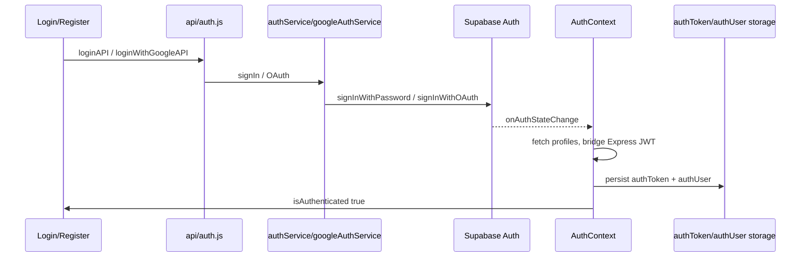
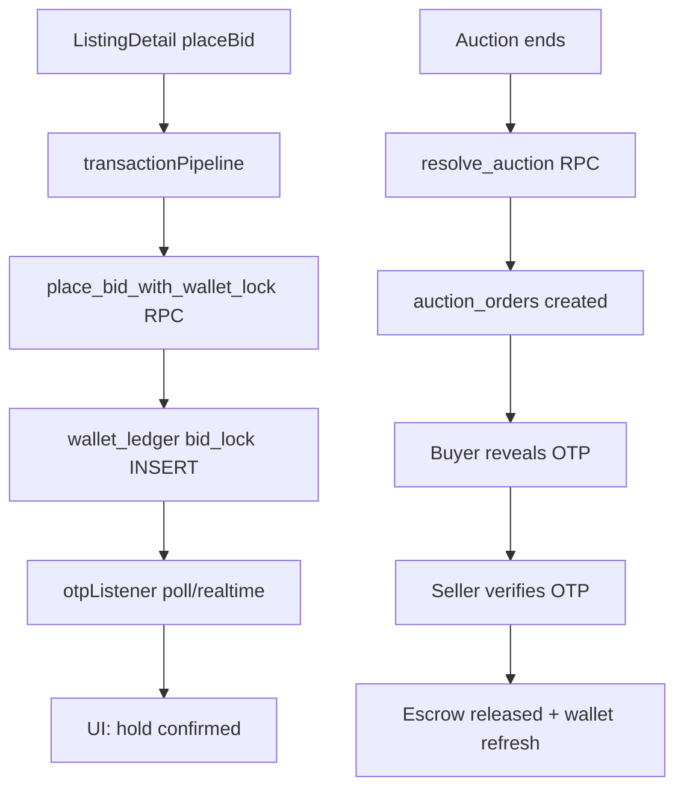

# Bidify Web Transition — Architectural Specification & Design System Blueprint

**Document version:** 1.0  
**Source of truth:** `d:\BidifyMobile` mobile codebase + Supabase backend  
**Generated from:** Full workspace analysis (mobile screens, services, navigation, Supabase SQL, contexts)  
**Constraint:** Specification-only — no React implementation in this document  
**Recommended web stack:** Next.js App Router (or Vite + React Router) + `@supabase/supabase-js` + service layer ported from `src/services/`

---

## Table of Contents

1. [SECTION 1: THE DESIGN SYSTEM](#section-1-the-design-system)
2. [SECTION 2: WEB PAGES ROUTE MAP](#section-2-web-pages-route-map)
3. [SECTION 3: STATE & LOGIC SPECIFICATION](#section-3-state--logic-specification)
4. [SECTION 4: SUPABASE WEB IMPLEMENTATION GUIDE](#section-4-supabase-web-implementation-guide)
5. [Appendix A: Complete File Index](#appendix-a-complete-file-index)
6. [Appendix B: Provider Tree & Dependencies](#appendix-b-provider-tree--dependencies)
7. [Appendix C: Full RPC Catalog](#appendix-c-full-rpc-catalog)
8. [Appendix D: Storage Keys Reference](#appendix-d-storage-keys-reference)
9. [Appendix E: SQL Migration Checklist](#appendix-e-sql-migration-checklist)

---

## SECTION 1: THE DESIGN SYSTEM

### 1.1 Token Architecture (No Tailwind)

BidifyMobile has **no Tailwind** and **no NativeWind** in `package.json`. Styling is React Native `StyleSheet.create` plus token sources:

| Source | Absolute Path | Scope |
|--------|---------------|--------|
| Global tokens | `d:\BidifyMobile\src\theme\index.js` | Auth, KYC, forms, `AppButton`, `AppInput`, `Chip`, Chat, Wallet (partial), shared spacing/radius |
| Marketplace palette | `d:\BidifyMobile\src\constants\homePalette.js` | Home feed, listing cards, browse pills, tabs |
| Screen-local constants | Inline at top of screen files | Login, Wallet, My Orders, Listing Detail, headers |
| Reusable UI | `d:\BidifyMobile\src\components\ui\AppButton.js`, `AppInput.js`, `Chip.js` | Canonical button/input/chip patterns |

**Web recommendation:** Export tokens as CSS custom properties in `:root` and per-layout theme classes:
- `.theme-light-minimal` — global theme
- `.theme-marketplace` — home palette
- `.theme-glass-dark` — My Orders, Login backdrop
- `.theme-wallet` — Wallet screen
- `.theme-tab-dark` — bottom nav (mobile web only)

---

### 1.2 Global Color Palette (`src/theme/index.js`)

#### Core Neutrals — `colors` export

| Token | Hex | Usage |
|-------|-----|--------|
| `bg` | `#FFFFFF` | Page background (light minimalist mode) |
| `bgMuted` | `#F7F7F8` | Muted page sections |
| `surface` | `#F2F2F4` | Cards, inactive chips |
| `surfaceAlt` | `#F5F5F7` | Input field backgrounds |
| `border` | `#E5E5EA` | Default borders |
| `borderStrong` | `#D1D1D6` | Outline button borders |
| `text` | `#111111` | Primary body text |
| `textMuted` | `#6B7280` | Secondary / muted text |
| `textFaint` | `#9CA3AF` | Placeholders, faint labels |
| `primary` | `#111111` | Primary CTA fill |
| `primaryText` | `#FFFFFF` | Text on primary CTA |
| `accent` | `#111111` | Accent (same as primary in current theme) |
| `white` | `#FFFFFF` | Explicit white |
| `black` | `#000000` | Explicit black |

#### Semantic Colors — `colors` export

| Token | Hex | Usage |
|-------|-----|--------|
| `success` | `#16A34A` | Success states, credit indicators |
| `successSoft` | `#DCFCE7` | Success background tint |
| `successSoftBorder` | `#BBF7D0` | Success border tint |
| `danger` | `#DC2626` | Errors, live badges, debit |
| `warning` | `#B45309` | Warning text |
| `info` | `#1D4ED8` | Info links, blue CTAs |

#### Chip Colors — `colors` export

| State | Background | Text |
|-------|------------|------|
| Inactive (`chipBg` / `chipText`) | `#F2F2F4` | `#111111` |
| Active (`chipActiveBg` / `chipActiveText`) | `#111111` | `#FFFFFF` |

---

### 1.3 Marketplace Palette (`src/constants/homePalette.js`)

Export name: `HOME`

| Token | Hex / Value | Usage |
|-------|-------------|--------|
| `white` | `#FFFFFF` | Card surface |
| `black` | `#000000` | Active pill/tab fill, primary CTA |
| `divider` | `#E0E0E0` | Card borders |
| `surface` | `#F5F5F5` | Image placeholder, auction card footer |
| `pageBg` | `#FAFAFA` | Home page background |
| `segmentTint` | `#F5F5F5` | Segment control tint |
| `charcoal` | `#666666` | Secondary labels |
| `priceNavy` | `#1A2744` | Auction price display on cards |
| `borderSoft` | `#D4D4D4` | Soft borders |
| `tabBorder` | `#D1D1D1` | Tab dividers |
| `goldDeep` | `#4A3810` | Deep gold accent |
| `goldDark` | `#6B4E1A` | Dark gold |
| `goldMid` | `#9A7224` | Mid gold |
| `goldLight` | `#C9A227` | Primary gold CTA (Wallet, headers) |
| `goldPale` | `#F5E6C8` | Pale gold wash |
| `cardRadius` | `12` (px) | Standard listing card radius |

#### Home Tab Labels (`HOME_TABS`)

`['Trending', 'Ending Soon', 'Ended']`

#### Home Browse Filters (`HOME_BROWSE_FILTERS`)

`['All', 'Newly Listed', 'Auctions', 'Ended Auctions']`

---

### 1.4 Feature-Specific Palettes (Screen-Local — Must Preserve Per Route)

#### Login Screen (`src/screens/LoginScreen.js`)

| Element | Hex / Value |
|---------|-------------|
| Safe area background | `#0B1120` |
| LinearGradient colors | `#0F172A` → `#020617` |
| Auth card background | `#FFFFFF` |
| Card border radius | `24px` |
| Card shadow (iOS) | `#000000`, offset `{0,15}`, opacity `0.25`, radius `35` |
| Card elevation (Android) | `20` |
| Brand logo text ("Bidify") | `#1E3A8A`, fontSize `44`, fontWeight `900`, letterSpacing `2` |
| Title | `#0F172A`, fontSize `24`, fontWeight `800` |
| Subtitle | `#64748B`, fontSize `15` |
| Input container bg | `#F8FAFC` |
| Input container border | `#E2E8F0`, width `1.5` |
| Input container radius | `16px`, height `56px` |
| Input icon color | `#94A3B8` |
| Input text | `#0F172A`, fontSize `16`, fontWeight `500` |
| Placeholder | `#94A3B8` |
| Forgot password link | `#0F172A`, fontSize `14`, fontWeight `600` |
| Error text | `#DC2626`, fontSize `13`, fontWeight `600` |
| Login button bg | `#0F172A` |
| Login button radius | `16px`, height `56px` |
| Login button text | `#FFFFFF`, fontSize `18`, bold |
| Login button disabled opacity | `0.75` |
| OR divider line | `#E2E8F0`, height `1px` |
| OR divider text | `#94A3B8`, fontSize `12`, fontWeight `700`, letterSpacing `1.2` |
| OR divider gap | `14px`, marginBottom `16px` |
| Google redirect hint | `#94A3B8`, fontSize `13` |
| Footer muted | `#64748B`, fontSize `14` |
| Footer link | `#0F172A`, fontSize `14`, fontWeight `700` |

#### Google Sign-In Button (`src/components/GoogleSignInButton.js`)

| Element | Hex / Value |
|---------|-------------|
| Button background | `#FFFFFF` |
| Button border | `1px` `#DADCE0` |
| Button border radius | `12px` |
| Button height | `52px` |
| Button text | `#3C4043`, fontSize `16`, fontWeight `600`, letterSpacing `0.15` |
| Disabled opacity | `0.65` |
| Active opacity | `0.82` |
| Loading spinner color | `#3C4043` |
| Google logo blue | `#4285F4` |
| Google logo red | `#EA4335` |
| Google logo yellow | `#FBBC05` |
| Google logo green | `#34A853` |
| Icon slot width | `48px` |
| Shadow (iOS) | `#000`, offset `{0,1}`, opacity `0.06`, radius `2` |
| Shadow (Android) | elevation `1` |

#### Wallet Screen (`src/screens/WalletScreen.js`)

| Element | Hex / Value |
|---------|-------------|
| `HEADER_BG` | `#1E3A8A` |
| `HEADER_TEXT` | `#FFFFFF` |
| `WALLPAPER_BG` | `#FEFDF5` |
| `CARD_SURFACE` | `#FDFDF9` |
| `CREDIT_GREEN` | `#059669` |
| `DEBIT_RED` | `#DC2626` |
| `GOLD_CTA` | `#C9A227` |
| `GOLD_CTA_DARK` | `#A67C00` |
| Tab inactive icon | `#64748B` |
| Tab active icon | `#FFFFFF` |
| Placeholder | `#94A3B8` |
| Chevron | `#999` |
| `MIN_TOPUP_PKR` | `1000` (business rule, not color) |

##### Wallet Ledger Kind Icon Backgrounds (`KIND_ICON_BG`)

| Kind | Background Hex |
|------|----------------|
| `deposit` | `#D1FAE5` |
| `topup` | `#D1FAE5` |
| `token_paid` | `#FEE2E2` |
| `token_refund` | `#DBEAFE` |
| `win_hold_note` | `#FEF3C7` |
| `bid_lock` | `#FFEDD5` |
| `bid_refund` | `#D1FAE5` |
| `bid_hold` | `#FFEDD5` |
| `bid_hold_released` | `#D1FAE5` |
| `listing_fee` | `#FEE2E2` |
| `escrow_refund` | `#DBEAFE` |

##### Payment Method Colors (Wallet top-up UI)

| Method | Color | Background |
|--------|-------|------------|
| (green method) | `#16A34A` | `#DCFCE7` |
| (purple method) | `#5B21B6` | `#EDE9FE` |

##### Transaction Card Shadow

| Property | Value |
|----------|-------|
| shadowColor | `#1E293B` |

#### My Orders Screen — Glass Dark Theme (`src/screens/MyOrdersScreen.js`)

| Constant | Value |
|----------|-------|
| `BG_TOP` | `#0F172A` |
| `BG_BOTTOM` | `#020617` |
| `GLASS` | `rgba(255, 255, 255, 0.08)` |
| `GLASS_BORDER` | `rgba(255, 255, 255, 0.14)` |
| `TEXT` | `#F8FAFC` |
| `GOLD` | `#C9A227` |
| MUTED text | `#94A3B8` (from styles) |
| Active tab bg | `rgba(96, 165, 250, 0.22)` |
| Tab text | fontSize `14`, fontWeight `600` |
| Tab text active | fontWeight `700` |
| Tab count bg | `rgba(255,255,255,0.1)` |
| Tab count active bg | `rgba(15, 23, 42, 0.5)` |
| Glass card radius | `18px` |
| Glass card shadow (iOS) | `#000`, offset `{0,8}`, opacity `0.35`, radius `16` |
| Glass card elevation (Android) | `6` |
| Thumbnail | `72×72px`, radius `12px`, bg `rgba(0,0,0,0.25)` |
| Card title | fontSize `16`, fontWeight `700`, color `TEXT` |
| Role pill (buyer) | bg `rgba(96, 165, 250, 0.25)` |
| Role pill (seller) | bg `rgba(201, 162, 39, 0.28)` |
| Role pill text | fontSize `11`, fontWeight `700` |
| Status pending chip | bg `rgba(251, 191, 36, 0.22)` |
| Status done chip | bg `rgba(52, 211, 153, 0.2)` |
| Status disputed chip | bg `rgba(248, 113, 113, 0.28)` |
| Status chip text | fontSize `11`, fontWeight `600` |
| Status disputed text | `#FECACA`, fontWeight `800` |
| Escrow line | fontSize `14`, fontWeight `700`, color `GOLD` |
| Primary CTA buttons | `#2563EB`, `#1D4ED8` |
| Dispute button | `#B91C1C` |
| Reveal OTP button | styled `revealOtpBtn` / `revealOtpBtnText` |

#### Home Floating Header (`src/components/home/HomeFloatingHeader.js`)

| Constant | Value |
|----------|-------|
| `PROFILE_ICON` | `#333333` |
| `LABEL_GREY` | `#333333` |
| `NOTIF_GOLD` | `#FF8C00` |
| `HEADER_BG` | `#FFFFFF` |
| `WALLET_BRONZE` gradient | `#6B3A12`, `#8B4513`, `#A0522D`, `#CD853F` |
| Wallet sheen overlay | `rgba(255,255,255,0.35)` → `rgba(255,255,255,0.05)` → `transparent` |
| Wallet icon color | `#FFF8F0` |
| Notification shell border | `rgba(255, 140, 0, 0.35)` |
| Notification shell bg | `#FFF8EE` |
| Notification inner bg | `#FFF4E0` |
| Header bottom border (web) | `#E8ECF0` |
| Layered shell border | `#EBEBEB` |
| Layered shell bg | `#FAFAFA` |
| Count badge bg | `#DC2626` |
| Count badge border | `HEADER_BG` (#FFFFFF) |
| Count badge text | `#FFFFFF`, fontSize `9`, fontWeight `800` |
| `ICON_SIZE` (notifications) | `44px` |
| `ICON_SIZE_ACTION` (wallet/profile) | `36px` |
| `ICON_GLYPH` | `22px` |
| `ICON_GLYPH_ACTION` | `18px` |
| `SIDE_GAP` (profile↔wallet) | `8px` (compact: `6px`) |
| `COL_NOTIF` | `72px` |
| `COL_ACTION` | `48px` |
| `LABEL_FONT_SIZE` | `10px` |
| `H_PAD` | `16px` (compact: `14px`) |
| `ACTION_RADIUS` | `12px` |
| `ACTION_INNER_RADIUS` | `9px` |
| Header shadow (iOS) | `#000`, opacity `0.05`, radius `3` |
| Header divider shadow (iOS) | `#000`, offset `{0,2}`, opacity `0.06`, radius `4` |

#### Main Tab Navigator (`src/navigation/MainTabNavigator.js`)

| Element | Hex |
|---------|-----|
| Tab bar background | `#242424` |
| Active tab icon | `#FFFFFF` |
| Sell FAB ring colors | `#4A90E2`, `#50E3C2`, `#F5A623` |

#### Listing Detail Screen (additional colors found in codebase)

| Element | Hex |
|---------|-----|
| Placeholder bg | `#f0f0f0`, `#f8f9fa` |
| Moderation banner warning | `#fff8e6` |
| Moderation banner error | `#fdecea` |
| Slate body text family | `#0F172A`, `#1E293B`, `#475569` |

#### My Bids Screen

| Element | Hex |
|---------|-----|
| CTA gradient | `#1E3A8A` → `#4338CA` |

#### KYC Screens

| Element | Hex |
|---------|-----|
| Review gradient | `#1E3A8A` → `#0F172A` |
| Dark panel gradient | `#0B0E11` → `#12151C` |
| Gold gradient | `#FCD34D` → `#F0B90B` → `#D97706` |

#### Chatbot Panel

| Element | Hex |
|---------|-----|
| Gradient | `#1E3A8A` → `#6B21A8` |

#### Web Modal Button (`src/components/WebModalButton.js` or similar)

| Variant | Colors |
|---------|--------|
| Primary | `#1E3A8A` |
| Danger | `#DC2626` |
| Ghost bg | `#F1F5F9` |
| Ghost text | `#475569` |
| Font | `15px` / `700` |

#### Listing Card (Profile grid — `ListingCard`)

| Element | Hex |
|---------|-----|
| Card border | `#E8ECF0` |
| Card radius | `12px` |
| Auction badge | `#B91C1C` |
| Ended badge | `#64748B` |
| Buy-now badge | white bg + indigo text |
| Price | `#1E3A8A` |

#### Auction / Standard Listing Cards (Home)

| Element | Hex / Value |
|---------|-------------|
| Card bg | `#FFFFFF` |
| Card border | `#E0E0E0` (HOME.divider) |
| Card radius | `12–16px` |
| Image area | `#F5F5F5` (HOME.surface) |
| Shadow | black, opacity `0.07–0.14`, radius `6–14` |
| Auction price | `#1A2744` (HOME.priceNavy) or `#1E3A8A` |
| Live pill overlay | `rgba(0,0,0,0.52)` |
| Live dot | `#EF4444` |
| CTA | black solid + white sheen `rgba(255,255,255,0.12)` → transparent |

#### iOS Link Blue (used in various screens)

`#007AFF`

#### App Error Boundary (`App.js`)

| Element | Hex |
|---------|-----|
| Background | `#FFFFFF` |
| Title | `#111` |
| Body | `#444` |

---

### 1.5 Typography Scale

#### Global Typography (`typography` in `src/theme/index.js`)

| Token | fontSize | fontWeight | color | letterSpacing |
|-------|----------|------------|-------|---------------|
| `display` | 28 | 800 | `#111111` | -0.4 |
| `title` | 22 | 800 | `#111111` | -0.3 |
| `h2` | 18 | 700 | `#111111` | — |
| `h3` | 16 | 700 | `#111111` | — |
| `body` | 14 | (default/400) | `#111111` | — |
| `bodyMuted` | 14 | (default) | `#6B7280` | — |
| `small` | 12 | (default) | `#6B7280` | — |
| `label` | 13 | 600 | `#111111` | — |

#### Marketplace Ad Hoc Typography (Home / Cards)

| Usage | Size | Weight | Notes |
|-------|------|--------|-------|
| Section titles | 22 | 800 | |
| Card titles | 15–17 | 600–700 | |
| Hero price display | 28 | 900 | |
| Caps labels | 10 | 700 | uppercase |
| Tab/pill text | 12–13 | 600–700 | |
| Header action labels | 10 | 500 | Wallet, Profile, Notifications |
| Seller labels on cards | 14 | — | color `#64748B` |

#### Button Typography

| Component | Size | Weight |
|-----------|------|--------|
| `AppButton` | 16 | 700 |
| `RegisterScreen` submit | 16 | 800 |
| `WebModalButton` | 15 | 700 |
| Login primary | 18 | bold |
| Google sign-in | 16 | 600 |

#### Input Typography

| Component | Size | Weight |
|-----------|------|--------|
| `AppInput` | 15 | — |
| Login inputs | 16 | 500 |

---

### 1.6 Spacing Tokens (`spacing` in `src/theme/index.js`)

| Token | px |
|-------|-----|
| `xs` | 4 |
| `sm` | 8 |
| `md` | 12 |
| `lg` | 16 |
| `xl` | 20 |
| `xxl` | 24 |
| `xxxl` | 32 |

---

### 1.7 Border Radius Tokens (`radius` in `src/theme/index.js`)

| Token | px |
|-------|-----|
| `sm` | 8 |
| `md` | 12 |
| `lg` | 14 |
| `xl` | 18 |
| `pill` | 999 |

#### Frequent One-Off Radius Values (screens)

`6`, `10`, `11`, `14`, `16`, `20`, `22`, `24`, `28` — used for tab bar sell button, login card, glass cards, wallet shells, etc.

---

### 1.8 Shadow Tokens

#### Global Card Shadow (`shadows.card` in `src/theme/index.js`)

| Platform | Values |
|----------|--------|
| iOS | shadowColor `#000`, offset `{0,1}`, opacity `0.04`, radius `6` |
| Android | elevation `1` |

#### Home Listing Card Shadows

shadowColor `#000`, opacity `0.07–0.14`, radius `6–14`

#### Glass Order Card (My Orders)

shadowColor `#000`, offset `{0,8}`, opacity `0.35`, radius `16`, elevation `6`

---

### 1.9 Component Specifications

#### AppButton (`src/components/ui/AppButton.js`)

| Property | Value |
|----------|-------|
| minHeight | 52px |
| borderRadius | `radius.lg` = 14px |
| Variant `primary` | bg `#111111`, text `#FFFFFF` |
| Variant `outline` | bg `#FFFFFF`, border `#D1D1D6` |
| Variant `ghost` | transparent |
| Disabled opacity | 0.55 |
| primaryText fontSize | 16, fontWeight 700 |

#### Google Sign-In Button

See Section 1.4 Login/Google table above.

#### Listing Cards (Home — `AuctionListingCard`, `StandardListingCard`)

| Property | Value |
|----------|-------|
| Background | `#FFFFFF` |
| Border | `#E0E0E0` |
| Radius | 12–16px |
| Image area | `#F5F5F5` |
| CTA | Black solid + white sheen overlay |
| Auction footer section | `HOME.surface` |

#### Glass Order Card (My Orders)

| Property | Value |
|----------|-------|
| borderRadius | 18px |
| fill | `rgba(255,255,255,0.08)` |
| border | `rgba(255,255,255,0.14)` |
| thumbnail | 72×72, radius 12 |

#### Chip (`src/components/ui/Chip.js`)

| State | bg | text | radius |
|-------|-----|------|--------|
| Inactive | `#F2F2F4` | `#111111` | 999 |
| Active | `#111111` | `#FFFFFF` | 999 |

#### Home Header Column Layout

| Property | Value |
|----------|-------|
| Press scale animation | 0.94 on press in, 1 on press out |
| Label marginTop | 5px |
| LABEL_SLOT height | 14px |

---

### 1.10 Dark / Light Mode Behavior

**There is NO system theme switching.** No `useColorScheme`, no `Appearance` API, no dark palette in `theme/index.js`.

The app uses **multiple fixed visual modes** chosen per screen:

| Mode | Where Used | Character |
|------|------------|-----------|
| Light minimalist | Global theme, Register, KYC, forms | White/gray/black (`theme/index.js`) |
| Light marketplace | `homePalette` + Home | `#FAFAFA` page, gold accents |
| Dark glass | My Orders, Login gradient backdrop | Slate `#0F172A` family |
| Dark tab bar | `MainTabNavigator` (mobile) | `#242424` bar, white active icons |
| Brand blue | Wallet, My Bids header, Login logo | `#1E3A8A` |

**Web guidance:** Apply layout-level theme classes per route. Do NOT implement a single global dark mode toggle until product requests unified theming. Migrating one screen's palette does not auto-update others.

---

### 1.11 Complete CSS Variables Block (Recommended for Web)

```css
:root {
  /* === Global (theme/index.js) === */
  --color-bg: #FFFFFF;
  --color-bg-muted: #F7F7F8;
  --color-surface: #F2F2F4;
  --color-surface-alt: #F5F5F7;
  --color-border: #E5E5EA;
  --color-border-strong: #D1D1D6;
  --color-text: #111111;
  --color-text-muted: #6B7280;
  --color-text-faint: #9CA3AF;
  --color-primary: #111111;
  --color-primary-text: #FFFFFF;
  --color-accent: #111111;
  --color-success: #16A34A;
  --color-success-soft: #DCFCE7;
  --color-success-soft-border: #BBF7D0;
  --color-danger: #DC2626;
  --color-warning: #B45309;
  --color-info: #1D4ED8;
  --color-white: #FFFFFF;
  --color-black: #000000;
  --color-chip-bg: #F2F2F4;
  --color-chip-text: #111111;
  --color-chip-active-bg: #111111;
  --color-chip-active-text: #FFFFFF;

  /* === Brand === */
  --color-brand-blue: #1E3A8A;
  --color-brand-indigo: #1E3A8A;
  --color-gold: #C9A227;
  --color-gold-dark: #A67C00;
  --color-gold-mid: #9A7224;
  --color-gold-pale: #F5E6C8;
  --color-gold-deep: #4A3810;
  --color-notif-orange: #FF8C00;
  --color-ios-link: #007AFF;

  /* === Marketplace (homePalette) === */
  --color-page-bg: #FAFAFA;
  --color-card-border: #E0E0E0;
  --color-card-surface: #F5F5F5;
  --color-price-navy: #1A2744;
  --color-charcoal: #666666;
  --color-tab-border: #D1D1D1;

  /* === Login / Dark glass === */
  --color-slate-900: #0F172A;
  --color-slate-950: #020617;
  --color-slate-800: #0B1120;
  --color-glass-text: #F8FAFC;
  --color-glass-muted: #94A3B8;
  --color-glass-fill: rgba(255, 255, 255, 0.08);
  --color-glass-border: rgba(255, 255, 255, 0.14);
  --color-google-border: #DADCE0;
  --color-google-text: #3C4043;

  /* === Wallet === */
  --color-wallet-header: #1E3A8A;
  --color-wallet-wallpaper: #FEFDF5;
  --color-wallet-card: #FDFDF9;
  --color-credit: #059669;
  --color-debit: #DC2626;

  /* === Google logo === */
  --color-google-blue: #4285F4;
  --color-google-red: #EA4335;
  --color-google-yellow: #FBBC05;
  --color-google-green: #34A853;

  /* === Spacing === */
  --space-xs: 4px;
  --space-sm: 8px;
  --space-md: 12px;
  --space-lg: 16px;
  --space-xl: 20px;
  --space-xxl: 24px;
  --space-xxxl: 32px;

  /* === Radius === */
  --radius-sm: 8px;
  --radius-md: 12px;
  --radius-lg: 14px;
  --radius-xl: 18px;
  --radius-pill: 999px;
  --radius-card-home: 12px;
  --radius-login-card: 24px;
  --radius-glass-card: 18px;

  /* === Typography === */
  --font-display: 28px;
  --font-title: 22px;
  --font-h2: 18px;
  --font-h3: 16px;
  --font-body: 14px;
  --font-small: 12px;
  --font-label: 13px;
  --weight-display: 800;
  --weight-title: 800;
  --weight-h2: 700;
  --weight-h3: 700;
  --weight-label: 600;
  --weight-button: 700;

  /* === Shadow === */
  --shadow-card: 0 1px 6px rgba(0, 0, 0, 0.04);
  --shadow-login-card: 0 15px 35px rgba(0, 0, 0, 0.25);
  --shadow-glass-card: 0 8px 16px rgba(0, 0, 0, 0.35);
}

.theme-glass-dark {
  --color-bg: #0F172A;
  --color-bg-gradient-end: #020617;
  --color-text: #F8FAFC;
  --color-text-muted: #94A3B8;
}

.theme-wallet {
  --color-bg: #FEFDF5;
  --color-header: #1E3A8A;
}

.theme-marketplace {
  --color-bg: #FAFAFA;
}
```

---

## SECTION 2: WEB PAGES ROUTE MAP

### 2.1 Navigation Hierarchy (Mobile — Source of Truth)

**Entry:** `d:\BidifyMobile\App.js` → `RootNavigator` (`src/navigation/RootNavigator.js`)

```
NavigationContainer (linking: src/navigation/linking.js)
└── Root Stack [headerShown: false] — exactly ONE child based on auth
    ├── AppStack          (when AuthContext.isAuthenticated === true)
    └── AuthStack         (when AuthContext.isAuthenticated === false)
```

**Gate logic:** `RootNavigator` shows `AuthBootSplash` while `isLoading`, then `AuthStack` vs `AppStack`. Container `key` includes `user.id` to remount on user change.

**`adminNavigation.js`** is NOT a navigator — exports helpers: `resetToAdminPanel`, `enterAdminPanel`, `openAdminSupportChat`, `ADMIN_ROOT_ROUTE = 'AdminPanel'`.

**`KycOnboardingStack.js`** exists at `src/navigation/KycOnboardingStack.js` but is **NEVER mounted** in live tree.

---

### 2.2 Auth Stack Routes (Unauthenticated)

**File:** `src/navigation/AuthStack.js`  
**Navigator:** `createNativeStackNavigator`, `headerShown: false`

| Route Name | Screen File | Initial? | Params / Notes |
|------------|-------------|----------|----------------|
| `Login` | `src/screens/LoginScreen.js` | YES | Post-login → root swaps to AppStack; admins get `initialRoute: 'AdminPanel'` |
| `Register` | `src/screens/RegisterScreen.js` | | |
| `SignUp` | same as Register | | Alias route, `animation: 'none'` |
| `KycScan` | `src/screens/KycScanScreen.js` | | `{ fromSignup, registration }`, `onboarding`, `kycRetry`, `prefillProfile` |
| `KycSelfie` | `src/screens/KycSelfieScreen.js` | | From KycScan: `{ fromSignup, registration }` |
| `KycReviewStatus` | `src/screens/KycReviewStatus.js` | | |
| `CnicVerification` | `src/screens/CnicVerificationScreen.js` | | **Auth-only** — NOT on AppStack |
| `ForgotPassword` | `src/screens/ForgotPasswordScreen.js` | | In: `{ prefillEmail? }` |
| `OtpVerify` | `src/screens/OtpVerifyScreen.js` | | In: `{ email, devOtp? }` — legacy API only when Supabase off |
| `ResetPassword` | `src/screens/ResetPasswordScreen.js` | | In: `{ email, resetToken }` |

**Deep links (linking.js under AuthStack):**

| URL path | Route |
|----------|-------|
| `login` | Login |
| `register` | Register |
| `forgot-password` | ForgotPassword |
| `otp` | OtpVerify |
| `reset-password` | ResetPassword |
| `kyc/scan` | KycScan |
| `kyc/selfie` | KycSelfie |
| `kyc/status` | KycReviewStatus |

---

### 2.3 App Stack Routes (Authenticated)

**File:** `src/navigation/AppStack.js`  
**Initial route:** `MainTabs`  
**Post-login:** `PostLoginDeepLink` consumes `AuthContext.pendingRoute`

#### 2.3.1 Main Tabs (`MainTabNavigator.js`)

**Navigator:** `createBottomTabNavigator`

| Tab Route | Tab Label | Screen File | Notes |
|-----------|-----------|-------------|-------|
| `Home` | Home | `src/screens/HomeScreen.js` | `navigate('MainTabs', { screen: 'Home' })` |
| `MyOrders` | Orders | `src/screens/MyOrdersScreen.js` | **Also registered on AppStack** (duplicate) |
| `Sell` | Sell (custom FAB) | `src/screens/CreateScreen.js` | Create listing |
| `MyBids` | My Bids | `src/screens/MyBidsScreen.js` | Embeds `<MyAuctionsScreen embedded />` |
| `Chats` | Chats | `src/screens/ChatListScreen.js` | Badge from `ChatUnreadContext` |

**FAB overlay:** `BidifyAIFab` — NOT a route.

**Tab bar colors:** bg `#242424`, active icons white.

#### 2.3.2 App Stack Screens (Above Tabs)

| Route | Screen File | Header | Params |
|-------|-------------|--------|--------|
| `ListingDetail` | `ListingDetailScreen.js` | Yes | `{ listing }` primary; `{ listing, openChat: true }`; `{ listingId? }` |
| `PaymentCheckout` | `PaymentCheckoutScreen.js` | Yes | `{ listing, amount, buyerId?, buyerName? }` |
| `Chat` | `ChatScreen.js` | Yes | `{ conversationId?, listingId?, listing?, title?, listingTitle?, listingImage? }` |
| `Profile` | `ProfileScreen.js` | Yes | — |
| `ProfileView` | `ProfileViewScreen.js` | Yes | `{ userId?, sellerId?, sellerName? }` |
| `PublicProfileView` | ProfileViewScreen.js | Yes | Same params |
| `Wallet` | `WalletScreen.js` | Hidden | — |
| `MyOrders` | `MyOrdersScreen.js` | Hidden | **Duplicate** — stack push from MyBids |
| `Notifications` | `NotificationsScreen.js` | Hidden | — |
| `DisputeSupportChat` | `DisputeSupportChatScreen.js` | Yes | `{ orderId, ticketId?, listingTitle?, orderStatus? }` |
| `AccountSettings` | `AccountSettingsScreen.js` | Yes | — |
| `KycScan` | `KycScanScreen.js` | Yes | `{ onboarding, fromSignup, kycRetry, prefillProfile }` |
| `KycSelfie` | `KycSelfieScreen.js` | Yes | Signup/onboarding params |
| `KycReviewStatus` | `KycReviewStatus.js` | Hidden, no gesture back | — |
| `HelpSupport` | `HelpSupportScreen.js` | Yes | — |
| `AdminPanel` | `AdminScreen.js` | Yes, no back | Admin root |
| `AdminDisputes` | `admin/AdminDisputesScreen.js` | Hidden | |
| `AdminSupportInbox` | `admin/AdminSupportInboxScreen.js` | Hidden | |
| `AdminSupportChat` | `admin/AdminSupportChatScreen.js` | Hidden | `{ orderId, ticketId?, listingTitle?, escrowAmount?, orderStatus?, showSettlementActions? }` |
| `AdminUserDetail` | `admin/AdminUserDetailScreen.js` | Hidden | `{ userId, displayName? }` |

**Deep links (linking.js under AppStack):**

| URL path | Route |
|----------|-------|
| `''` (root) | MainTabs |
| `listing/:listingId` | ListingDetail |
| `wallet` | Wallet |
| `profile` | Profile |

**Linking prefixes:** `Linking.createURL('/')`, `bidify://`, `http://localhost:8086`, `exp://`

---

### 2.4 Recommended Next.js App Router Structure

```
app/
  (auth)/
    login/page.tsx                    → LoginScreen
    register/page.tsx                 → RegisterScreen
    forgot-password/page.tsx
    otp/page.tsx                      → legacy API only
    reset-password/page.tsx
    kyc/
      scan/page.tsx
      selfie/page.tsx
      status/page.tsx
  (app)/
    layout.tsx                        → AppShell + providers
    page.tsx                          → HomeScreen (/)
    listing/[listingId]/page.tsx      → ListingDetailScreen
    checkout/[listingId]/page.tsx     → PaymentCheckoutScreen
    wallet/page.tsx                   → WalletScreen
    profile/page.tsx                  → ProfileScreen
    profile/[userId]/page.tsx         → ProfileViewScreen
    orders/page.tsx                   → MyOrdersScreen (single canonical route)
    bids/page.tsx                     → MyBidsScreen + MyAuctionsScreen
    sell/page.tsx                     → CreateScreen
    chats/page.tsx                    → ChatListScreen
    chat/[conversationId]/page.tsx    → ChatScreen
    notifications/page.tsx
    settings/page.tsx                 → AccountSettingsScreen
    help/page.tsx                     → HelpSupportScreen
    dispute/[orderId]/page.tsx        → DisputeSupportChatScreen
  (admin)/
    admin/page.tsx                    → AdminScreen
    admin/disputes/page.tsx
    admin/inbox/page.tsx
    admin/chat/[orderId]/page.tsx
    admin/users/[userId]/page.tsx
middleware.ts                         → auth gate (AuthStack vs AppStack)
```

---

### 2.5 Mobile Screen → Web URL Mapping (Complete)

| User-facing name | Mobile route name(s) | Web URL | Screen file |
|------------------|---------------------|---------|-------------|
| Home | `Home` (tab) | `/` | `HomeScreen.js` |
| Wallet | `Wallet` (stack) | `/wallet` | `WalletScreen.js` |
| Listing detail | `ListingDetail` | `/listing/[listingId]` | `ListingDetailScreen.js` |
| My Bids | `MyBids` (tab) | `/bids` | `MyBidsScreen.js` + `MyAuctionsScreen.js` |
| Orders | `MyOrders` (tab + stack) | `/orders` | `MyOrdersScreen.js` |
| Chats list | `Chats` (tab) | `/chats` | `ChatListScreen.js` |
| Chat thread | `Chat` | `/chat/[conversationId]` | `ChatScreen.js` |
| Sell / Create | `Sell` (tab) | `/sell` | `CreateScreen.js` |
| Login | `Login` | `/login` | `LoginScreen.js` |
| Register | `Register` / `SignUp` | `/register` | `RegisterScreen.js` |
| Profile (self) | `Profile` | `/profile` | `ProfileScreen.js` |
| Seller profile | `ProfileView` / `PublicProfileView` | `/profile/[userId]` | `ProfileViewScreen.js` |
| Notifications | `Notifications` | `/notifications` | `NotificationsScreen.js` |
| Checkout | `PaymentCheckout` | `/checkout/[listingId]` | `PaymentCheckoutScreen.js` |
| Account settings | `AccountSettings` | `/settings` | `AccountSettingsScreen.js` |
| Help | `HelpSupport` | `/help` | `HelpSupportScreen.js` |
| Dispute chat | `DisputeSupportChat` | `/dispute/[orderId]` | `DisputeSupportChatScreen.js` |
| Admin panel | `AdminPanel` | `/admin` | `AdminScreen.js` |
| Admin disputes | `AdminDisputes` | `/admin/disputes` | `AdminDisputesScreen.js` |
| Admin inbox | `AdminSupportInbox` | `/admin/inbox` | `AdminSupportInboxScreen.js` |
| Admin chat | `AdminSupportChat` | `/admin/chat/[orderId]` | `AdminSupportChatScreen.js` |
| Admin user | `AdminUserDetail` | `/admin/users/[userId]` | `AdminUserDetailScreen.js` |
| KYC scan | `KycScan` | `/kyc/scan` | `KycScanScreen.js` |
| KYC selfie | `KycSelfie` | `/kyc/selfie` | `KycSelfieScreen.js` |
| KYC status | `KycReviewStatus` | `/kyc/status` | `KycReviewStatus.js` |
| CNIC verification | `CnicVerification` | `/kyc/cnic` (suggested) | `CnicVerificationScreen.js` |
| Forgot password | `ForgotPassword` | `/forgot-password` | `ForgotPasswordScreen.js` |
| OTP verify | `OtpVerify` | `/otp` | `OtpVerifyScreen.js` |
| Reset password | `ResetPassword` | `/reset-password` | `ResetPasswordScreen.js` |

---

### 2.6 Screens on Disk NOT Registered in Navigation

| File | Status | Web recommendation |
|------|--------|---------------------|
| `SearchScreen.js` | Not registered | `/search?q=` or modal on Home; Home uses `HomeSearchBar` |
| `MyAuctionsScreen.js` | Embedded in MyBids only | Embed in `/bids` |
| `ChatListScreen.js.backup` | Backup | Ignore |
| `ListingDetailScreen.js.backup` | Backup | Ignore |
| `KycOnboardingStack.js` | Unused navigator | Use `/kyc/*` route group |

---

### 2.7 Responsive Layout Architecture

```
┌─────────────────────────────────────────────────────────────┐
│  AppShell (authenticated)                                   │
│  ┌──────────┬──────────────────────────────────────────────┐│
│  │ Sidebar  │  TopBar: Logo center | Wallet | Profile | 🔔 ││  ≥1024px
│  │ Nav      │  Main content                                 ││
│  │ Home     │                                               ││
│  │ Orders   │                                               ││
│  │ Bids     │                                               ││
│  │ Sell     │                                               ││
│  │ Chats    │                                               ││
│  └──────────┴──────────────────────────────────────────────┘│
│  ┌──────────────────────────────────────────────────────────┐│
│  │ TopBar (compact)                                          ││  <1024px
│  │ Main content                                              ││
│  │ BottomNav: Home | Orders | Sell | Bids | Chats           ││  <768px
│  └──────────────────────────────────────────────────────────┘│
└─────────────────────────────────────────────────────────────┘
```

| Breakpoint | Layout behavior |
|------------|-----------------|
| **≥1280px** | Listing detail: 55% gallery / 45% bid panel; Home 3–4 column grid |
| **1024–1279px** | Sidebar nav; Home 2–3 column grid |
| **768–1023px** | Collapsed top bar; 2 column cards |
| **<768px** | Bottom tab bar mirroring MainTabNavigator; single column; sticky HomeFloatingHeader-style top bar |

---

### 2.8 Screen-by-Screen Layout Notes

| Screen | Desktop (≥1024px) | Mobile web (<768px) |
|--------|-------------------|---------------------|
| **Home** | Sidebar + search + filter pills + 3–4 col grid | Bottom nav + 1 col feed + compact header |
| **Listing Detail** | Split panel media/info | Stacked + sticky bid bar |
| **Wallet** | Centered max-width 560px | Full width gold wallpaper |
| **My Orders** | Glass dark theme, 2-col cards | Same theme, tab Active/Completed |
| **My Bids** | Table/list with status chips | Card list |
| **Chats** | Master-detail (list + thread) | List → `/chat/:id` |
| **Sell** | Multi-step form max-width 720px | Full-screen steps |
| **Login** | Centered card 420px on gradient | Full viewport gradient |
| **Profile** | Listing grid 3–4 cols | 2 col grid |

---

### 2.9 Navigation Quirks to Preserve or Fix on Web

1. **Dual MyOrders:** Mobile has tab `MyOrders` AND stack `MyOrders`. `MyBidsScreen` calls `navigation.navigate('MyOrders')` targeting stack. **Web fix:** Single canonical `/orders`.

2. **KYC screens duplicated** on Auth and App stacks. Post-login KYC from Profile uses App routes. Web: same `/kyc/*` routes behind auth middleware.

3. **listingId-only navigation:** `MyBidsScreen` may pass `{ listingId }` but `ListingDetailScreen` initializes from `route.params.listing` object. **Web fix:** Always fetch listing by ID in route loader at `/listing/[listingId]`.

4. **linking.config vs RootNavigator:** Config names `AuthStack`/`AppStack` but root mounts only one child. Web: Next.js middleware replaces this pattern.

5. **Post-login redirect:** `AuthContext.pendingRoute` (string or `{ name, params }`) consumed by `PostLoginDeepLink` in AppStack. Web: `?redirect=` query param or sessionStorage `pendingRoute`.

6. **Admin navigation helpers:**
   - `resetToAdminPanel(navigation)` — clears stack to admin only
   - `resetToMainApp(navigation)` — `{ name: 'MainTabs' }`
   - `enterAdminPanel(navigation)` — from Profile menu
   - `openAdminSupportChat(navigation, payload)` — push AdminSupportChat with dispute payload

---

### 2.10 OAuth Redirect URLs for Web

From `src/services/supabase/authRedirect.js`:

| Function | Returns |
|----------|---------|
| `getSupabaseAuthRedirectUrl()` | `Linking.createURL('auth/callback')` or `bidify://auth/callback` |
| `getWebOAuthRedirectUrl()` | `{window.location.origin}/login` |
| `logSupabaseRedirectAllowListHints()` | Logs all URLs to whitelist |

**Must whitelist in Supabase Dashboard → Authentication → URL Configuration:**
- `http://localhost:3000/login`
- `http://192.168.x.x:3000/login` (LAN dev)
- `https://yourdomain.com/login`
- `bidify://auth/callback`
- Expo dev URLs if still testing mobile

---

## SECTION 3: STATE & LOGIC SPECIFICATION

### 3.1 Provider Tree (Exact — from App.js)

```
App.js
└── SafeAreaProvider
    └── StripeAppProvider
        └── AuthProvider                    ← session + profile
            └── ToastProvider (InAppToast)
                └── NotificationsProvider   ← depends on AuthContext.user
                    └── ChatUnreadProvider
                        └── WalletProvider  ← depends on useAuth()
                            └── ListingsSyncProvider ← AuthContext + useWallet()
                                └── ChatbotPanelProvider
                                    └── RootNavigator
                                    └── GlobalDeleteListingModal
```

| Context | File | Depends on | Exposes |
|---------|------|------------|---------|
| `AuthContext` | `src/context/AuthContext.js` | Supabase, profile service, Express bridge | `isAuthenticated`, `user`, `isLoading`, `login`, `logout`, `refreshProfile`, `updateProfile`, `pendingRoute`, `lockSession`, `waitForAuthState`, KYC modal |
| `WalletContext` | `src/context/WalletContext.js` | `useAuth()` | `balance`, `heldBalance`, `transactions`, `loading`, `error`, `refresh` |
| `ListingsSyncContext` | `src/context/ListingsSyncContext.js` | Auth + Wallet | marketplace listings, sync generation, delete |
| `NotificationsContext` | `src/context/NotificationsContext.js` | Auth | `unreadCount`, `refresh` |
| `ChatUnreadContext` | `src/context/ChatUnreadContext.js` | Auth | unread chat count |
| `ChatbotPanelProvider` | `src/context/ChatbotPanelContext.js` | — | AI FAB panel |

`useAuth` (`src/hooks/useAuth.js`) — memoized subset; does NOT expose `lockSession`, `waitForAuthState`, KYC modal helpers. Use `useContext(AuthContext)` when needed.

---

### 3.2 Storage Map — What Lives Where

#### Supabase Auth Session

| Platform | Adapter | File |
|----------|---------|------|
| iOS / Android | AsyncStorage | `src/services/supabaseClient.js` |
| Web | localStorage via `webAuthStorage` | `src/services/supabase/webAuthStorage.js` |

**Supabase client settings:**
- `flowType: 'pkce'`
- `persistSession: true`
- `autoRefreshToken: true`
- `detectSessionInUrl: false` — callbacks handled manually in `deepLinkSession.js`

#### App-Level Auth Mirror

| Key | Content | Writers |
|-----|---------|---------|
| `authToken` | Express JWT when bridge succeeds; else Supabase `access_token` | `AuthContext.persistSessionUser`, `login()`, `kycPostSubmitAuth` |
| `authUser` | JSON app user (profile-shaped) | Same |

**Web note:** KYC onboarding mirrors `authToken`/`authUser` to `localStorage` via `kycPostSubmitAuth.js` while Supabase keys remain in `webAuthStorage` — parallel stores.

#### Other Storage Keys

| Key | Purpose | Storage |
|-----|---------|---------|
| `bidify_pending_registration_v1` | CNIC/signup draft until email verified | AsyncStorage / localStorage |
| `bidify_kyc_signup_draft_v1` | Register → KycScan credentials | AsyncStorage |
| `kyc_status`, `kyc_start_time`, `kyc_verification_timestamp` | 5-min "under review" bid lock | AsyncStorage; web: localStorage |
| `mockUsers`, `mockListings` | Offline fallback | AsyncStorage |
| `profilePic_${userId}` | Local profile image URI | AsyncStorage |
| Bid token keys | Per-user/per-listing paid token | `bidTokenService.js` |
| `sessionStorage: bidify_oauth_error` | Web OAuth error for Login | sessionStorage |

---

### 3.3 Auth Flow — Complete Specification

#### Email Login Flow

1. `LoginScreen` → `loginAPI(email, password)` → `src/api/auth.js`
2. `signInWithEmail` in `authService.js`
3. Rejects unverified email (`!email_confirmed_at`) with sign-out
4. Loads `profiles` via `fetchProfileById` → `mapProfileRowToAppUser`
5. Returns `{ token: session.access_token, user }`
6. `LoginScreen` calls `AuthContext.login(token, user, { initialRoute })`
7. `onAuthStateChange` also runs `persistSessionUser` (may bridge token again)

#### Email Register Flow

1. `RegisterScreen` validates → `saveKycSignupDraft` → navigate `KycScan` with `fromSignup: true` (no account yet)
2. After KYC: `registrationService.registerBasicAccount` / `registerWithCnic`
3. `supabase.auth.signUp` with `emailRedirectTo: getSupabaseAuthRedirectUrl()`
4. If no session (email confirmation): `pendingEmailVerification`; draft in `bidify_pending_registration_v1`
5. On later sign-in: `finalizePendingRegistrationIfNeeded` completes profile upload

#### Google OAuth Flow

| Step | Native | Web |
|------|--------|-----|
| Start | `signInWithGoogle` → `WebBrowser.openAuthSessionAsync`, `skipBrowserRedirect: true` | Full redirect `window.location.assign(data.url)` |
| Redirect URL | `getSupabaseAuthRedirectUrl()` | `getWebOAuthRedirectUrl()` → `{origin}/login` |
| Complete | `applySupabaseAuthUrl` on result URL | `processWebAuthCallbackFromLocation` on boot + Login `useEffect` |
| Session | PKCE `exchangeCodeForSession` or hash `setSession` | Same + `stripAuthParamsFromBrowserUrl` |

`AuthContext` listens: `Linking.addEventListener('url')`, `AppState 'active'` for profile re-hydrate.

`LoginScreen` web `useEffect`: `completeGoogleOAuthIfPendingAPI()` on mount when URL looks like callback.

#### Password Reset — Two Modes

| Mode | When | Flow |
|------|------|------|
| **Supabase** | `isSupabaseConfigured()` | `requestPasswordOtpAPI` → `resetPasswordForEmail` + email link; `OtpVerifyScreen` throws if used |
| **Legacy API** | No Supabase | `POST /auth/password/request-otp` → `OtpVerifyScreen` → `verifyPasswordOtpAPI` → `ResetPassword` with `resetToken` |

#### Legacy / Mock Auth (no Supabase)

- Boot: read `authToken` + `authUser` from AsyncStorage only
- `loginAPI`/`registerAPI` fall back to `mockUsers` on network failure

#### Post-Auth Routing (`src/utils/postAuthNavigation.js`)

| Condition | Destination |
|-----------|-------------|
| Admin user (`isAdminUser`) | `AdminPanel` → web `/admin` |
| Verified profile | `MainTabs` → web `/` |
| Unverified / incomplete KYC | `KycScan` with `onboarding: true` → web `/kyc/scan?onboarding=true` |

Stored in `AuthContext.pendingRoute`; consumed by `AppStack` `PostLoginDeepLink`.

#### Session Lifecycle Rules

- **Email gate on hydrate:** unverified Supabase users signed out in `persistSessionUser`
- **Express bridge:** `bridgeExpressApiSession` → `POST /auth/bridge-login` → stored as `authToken`
- **Session lock:** `lockSession()` defers `SIGNED_OUT` during KYC sensitive flows
- **KYC poll:** while `under_review`, `refreshProfile` every 15s + on `AppState` active

---

### 3.4 AuthContext State Shape

#### React State

```typescript
isAuthenticated: boolean
user: AppUser | null
isLoading: boolean          // boot splash
pendingRoute: string | { name: string; params?: object } | null
kycUnderReviewModalVisible: boolean
```

#### AppUser Fields (from `mapProfileRowToAppUser` / `projectProfile`)

`id`, `uid`, `email`, `name`, `fullName`, `username`, `phoneNumber`, `cnic`, `cnicFrontUrl`, `cnicBackUrl`, `profileImage`, `role`, `isAdmin`, `walletBalance`, `heldBalance`, `emailVerified`, `verificationStatus` / `verification_status`, `fatherName`, `dob`, `isRealFace`, `verificationSubmittedAt`, `profileCompleted`

#### `login(token, userData, options)` Options

- `initialRoute`
- `initialRouteParams`
- `kycSubmitComplete`
- `showKycUnderReviewModal`

---

### 3.5 WalletContext — Complete Specification

#### State Shape

```typescript
balance: number           // profiles.wallet_balance (spendable)
heldBalance: number       // profiles.held_balance
transactions: Activity[] // from wallet_ledger via mapLedgerRowsToActivity
loading: boolean
error: string | null
refresh: () => Promise<{ balance: number; heldBalance: number } | null>
```

#### `refresh()` Resolution Order (MUST preserve exactly)

1. If `!isAuthenticated || !user?.id` → set zeros, return `{ balance: 0, heldBalance: 0 }`
2. `resolveWalletUserId(user.id)` — **prefers `auth.uid()` over `user.id`** when Supabase configured
3. **Direct Supabase:** `fetchProfileWallet(walletUserId)` → `wallet_balance`, `held_balance`, `locked_balance`
4. If `isAuxiliaryApiConfigured()`:
   - `GET /api/wallet` via `getWalletAPI()`
   - When `source === 'supabase'` and not offline:
     - Use API balances only if `!balanceFromDirectProfile`
     - Ledger from API `ledger` array → `mapLedgerRowsToActivity`
5. Fallback if no API ledger: `fetchWalletLedgerForUser(60)` → `mapLedgerRowsToActivity`
6. `refreshProfile()` to sync `user.walletBalance` / `user.heldBalance` on AuthContext user

#### WalletScreen Additional Local State

`WalletScreen.js` also loads:
- Locked balance display
- Activity rows via `loadActivity()` (local, not only WalletContext.transactions)
- `refresh` on focus via `useWallet().refresh`
- Top-up minimum: `MIN_TOPUP_PKR = 1000`

**UI rule:** Treat `WalletContext` as live balance source; `user.walletBalance` on auth user is secondary (updated after refresh).

---

### 3.6 wallet_ledger Entry Types — Complete Mapping

From `src/services/walletLedgerService.js` — `titleForEntryType` and `mapLedgerRowToActivity`:

| entry_type | UI Title | kind | isCredit |
|------------|----------|------|----------|
| `bid_lock` | Bid Hold Placed | `bid_lock` | false |
| `bid_refund` | Bid Hold Refunded | `bid_refund` | true |
| `auction_listing_fee` | Listing Fee Paid | (debit) | false |
| `topup` | Wallet Top-up | `deposit` | true |
| `escrow_lock` | Escrow Hold | — | false |
| `escrow_release` | Escrow Release | — | true |
| `escrow_refund` | Escrow Refund | — | true |
| `legacy_tier_release` | (mapped in service) | — | — |
| default | Wallet Transaction | — | — |

**CRITICAL:** Table `public.transactions` does **NOT exist** (PGRST205). All wallet activity is in `wallet_ledger`.

**Do NOT use** `bids.wallet_hold_applied` for hold detection. Use `wallet_ledger` where `entry_type = 'bid_lock'`.

**Removed from queries:** embed `listings ( title )` — caused PostgREST errors; titles from `metadata.listing_title` or `titleForEntryType` fallback.

---

### 3.7 Naming Clarification — Two "OTP" Systems

| Name | File | Purpose |
|------|------|---------|
| **Wallet hold listener** | `otpListener.js` | Confirms `bid_lock` in `wallet_ledger` after bid RPC — NOT delivery OTP |
| **Delivery OTP** | `auctionOrdersService.js` + `MyOrdersScreen.js` | Post-auction buyer→seller 6-digit handoff |
| **Password OTP** | `OtpVerifyScreen.js` + legacy API | Forgot password when Supabase NOT configured |

---

### 3.8 Escrow Flow A — Place Bid → Wallet Hold

```
ListingDetailScreen
  → placeBidAPI (src/api/bids.js)
  → bidsService.placeBid
  → runBidTransactionPipeline (transactionPipeline.js)
      → ensureBidPrerequisites (wallet gate, bid token, KYC lock)
      → placeBidWithWalletLockRpc
          → supabase.rpc('place_bid_with_wallet_lock', {
               p_listing_id, p_amount, p_security_fee: 0
             })
      → waitForWalletHoldConfirmed (otpListener.js)
          → Poll wallet_ledger every 450ms, timeout 20s
          → OR subscribeOTPListener realtime INSERT
      → emit WALLET_HOLD_CONFIRMED_EVENT ('bidify:wallet-hold-confirmed')
```

#### `waitForWalletHoldConfirmed` Rules (`otpListener.js`)

1. At start: resolve `uid` from `supabase.auth.getSession()` first (RLS alignment fix)
2. Poll: `wallet_ledger` where `user_id = uid`, `listing_id = listingId`, `entry_type = 'bid_lock'`
3. Match amount if specified
4. Timeout: 20 seconds default
5. Interval: 450ms
6. Realtime channel: `wallet-ledger-bid-lock:{uid}:{listingId}` on INSERT

#### `isBidLockLedgerRow(row, listingId, amount?)` Logic

- `entry_type === 'bid_lock'`
- `listing_id` matches (string compare)
- Optional: `amount` matches absolute value

---

### 3.9 Escrow Flow B — Auction End → Order Creation

```
useResolveAuctionOnEnd / auctionResolveScheduler
  → resolveAuction (auctionEscrowService.js)
      → Primary: supabase.rpc('resolve_auction', { p_listing_id, p_force })
      → Fallback: POST /api/escrow/resolve/:listingId { force }
  → Creates auction_orders row
  → OTP hash stored server-side (not plain text in DB)
  → listing marked resolved
```

**Client scheduler:** `auctionResolveScheduler.js`
- Polls ended listings every 45s (also in ListingsSyncContext)
- Emits `AUCTION_RESOLVED_EVENT` ('bidify:auction-resolved')
- `syncAuctionCompletionBeforeFetch` called before My Orders fetch (20s timeout)

**SQL prerequisites (MUST run in Supabase):**
- `supabase/escrow_phase_2_resolve_auction.sql`
- `supabase/fix_resolve_auction_create_orders.sql`

**Known production issue (diagnosed):** Stub `resolve_auction` marked listings resolved without creating `auction_orders` — fixed by above SQL.

---

### 3.10 Escrow Flow C — Delivery OTP (My Orders UI)

#### Order Status Normalization (`auctionOrdersService.normalizeOrderStatus`)

- Lowercase trim
- Strip prefix `auction_order_status.`
- Strip quotes
- Handle object wrappers: `raw.status`, `raw.value`, `raw.enum`, `raw.label`

#### `mapOrderRowForUi(row, currentUserId)` Output

| Field | Source |
|-------|--------|
| `id` | row.id |
| `listingId` | row.listing_id |
| `buyerId`, `sellerId` | row.buyer_id, row.seller_id |
| `winningBidAmount` | row.winning_bid_amount |
| `escrowAmount` | row.escrow_amount |
| `status` | normalized |
| `role` | buyer / seller / viewer |
| `isPending` | status === `pending_delivery` |
| `isCompleted` | status === `completed` |
| `isDisputed` | status === `disputed` |
| `isRefunded` | status === `refunded` |
| `listingTitle` | listings embed or metadata.listing_title or 'Auction item' |
| `listingImage` | listing.image_url or image_urls[0] |

#### UI Helper Functions (`MyOrdersScreen.js`)

```javascript
isPendingDelivery(order) → order.isPending || status === 'pending_delivery'
isDisputedOrder(order) → order.isDisputed || status === 'disputed'
isCompletedOrder(order) → isCompleted || status in (completed, refunded) || isRefunded
isActiveTabOrder(order) → NOT isCompletedOrder
```

#### Order Tabs

| Tab | Filter |
|-----|--------|
| **Active** | All orders except completed/refunded |
| **Completed** | `isCompleted` OR `isRefunded` |

#### UI Rendering Conditions — EXACT

| Role | Condition | Component shown |
|------|-----------|-------------------|
| **Buyer** | `isPendingDelivery(order)` AND `role === 'buyer'` | `BuyerEscrowPanel` |
| **Seller** | `isPendingDelivery(order)` AND `role === 'seller'` | `SellerEscrowPanel` |
| **Either** | `isDisputedOrder(order)` | Dispute CTA → DisputeSupportChat |
| **Completed tab** | `isCompletedOrder(order)` | Read-only card, NO OTP panels |

#### BuyerEscrowPanel Actions

- Text: "Reveal your 6-digit code only after you have safely received the item"
- Button: "Reveal Delivery OTP" → `revealBuyerDeliveryOtp(orderId)`
- Copy OTP to clipboard on success
- `raiseOrderDispute` available

#### SellerEscrowPanel Actions

- Text: "Enter the 6-digit delivery OTP the buyer gives you"
- 6-digit TextInput
- Button: "Verify & Release Escrow" → `verifyDeliveryOtp(orderId, code)`
- On success: `WalletContext.refresh()` + orders refetch
- `raiseOrderDispute` available

#### RPC + Fallback Chain

**Buyer reveal:**
```
revealBuyerDeliveryOtp(orderId)
  → RPC reveal_buyer_delivery_otp({ p_order_id })
  → Fallback GET /api/otp/reveal/:id
  → Fallback GET /api/escrow/orders/:id/reveal-otp
```

**Seller verify:**
```
verifyDeliveryOtp(orderId, code)
  → RPC verify_delivery_otp({ p_order_id, p_otp })
  → Fallback POST /api/otp/verify
  → Fallback POST /api/escrow/orders/:id/verify-otp
  → invalidOtp flag if message matches /invalid delivery otp/i
```

#### My Orders Fetch

```javascript
ORDER_BRIDGE_SELECT = `
  id, listing_id, buyer_id, seller_id, winning_bid_id,
  winning_bid_amount, escrow_amount, status,
  disputed_at, disputed_by, delivery_otp_expires_at,
  otp_verified_at, otp_verified_by, completed_at,
  created_at, updated_at, metadata
`
```

`resolveOrdersScreenUserId` — prefers `supabase.auth.getSession().user.id` over context user id.

---

### 3.11 Escrow Flow D — Disputes

```
raiseOrderDispute(orderId, reason)
  → RPC raise_order_dispute({ p_order_id, p_reason })
  → Fallback POST /api/dispute/raise
  → Local status → disputed
  → ensureOrderSupportTicket(orderId)
  → Navigate DisputeSupportChat
```

Admin settlement:
- `atomic_settle_dispute` → fallback `settle_order_dispute`
- `api/adminDisputes.js`

---

### 3.12 Escrow Flow E — Listing Fee Refund

**RPC:** `refund_auction_listing_fee({ p_listing_id })`  
**SQL file:** `supabase/listing_fee_500_refund.sql`

| Auction state | Bids | Result |
|---------------|------|--------|
| Ended/expired | 0 | Refund Rs. 500 to seller via wallet_ledger (idempotent key `auction_listing_fee_refund:ended_no_bids:{id}`) |
| Ended/expired | ≥1 | `{ refunded: false, reason: 'has_bids_fee_retained' }` |
| Active | any | No refund |

**Business rule:** SQL does NOT delete listings. Caller `listingsService.deleteMyListing` still calls RPC before delete — listings may be locked in app UI.

**Separate function:** `refund_auction_listing_fee_no_bids` in `escrow_phase_2_resolve_auction.sql` (used inside `resolve_auction`).

---

### 3.13 Realtime Subscriptions — Complete

| Channel name | Table | Events | Filter | File |
|--------------|-------|--------|--------|------|
| `listings-sync-marketplace` | `listings` | `*` | none | `ListingsSyncContext.js` |
| `wallet-ledger-bid-lock:{uid}:{lid}` | `wallet_ledger` | INSERT | `user_id=eq.{uid}` | `otpListener.js` |
| `auction_orders_live:{uid}` | `auction_orders` | INSERT,UPDATE,DELETE | RLS scopes rows | `auctionOrdersService.js` |
| `notifications:{uid}` | `notifications` | INSERT,UPDATE | `user_id=eq.{uid}` | `notificationService.js` |
| `chat-unread:{uid}` | `messages` | INSERT,UPDATE | none | `chatService.js` |

#### Device Events (replace with CustomEvent on web)

| Event name | Emitter | Consumers |
|------------|---------|-----------|
| `bidify:wallet-hold-confirmed` | `otpListener.js` | `ListingDetailScreen`, `MyOrdersScreen` |
| `bidify:auction-resolved` | `auctionResolveScheduler.js` | `MyOrdersScreen` |

#### Polling Intervals

| What | Interval |
|------|----------|
| ListingsSync auction resolve scan | 45s |
| AuthContext KYC profile sync | 15s (while under_review) |
| waitForWalletHoldConfirmed | 450ms poll, 20s timeout |
| syncAuctionCompletionBeforeFetch | 20s timeout |

---

### 3.14 ListingsSyncContext Logic

- Initial: `fetchListings()` from Supabase `listings` ORDER BY created_at DESC
- Realtime: `listings` `*` → silent marketplace reload
- Polling: auction resolve scan 45s
- Delete: calls `refund_auction_listing_fee` RPC before `delete()` when configured
- Uses `AuthContext` for user, `WalletContext.refresh` after fee operations

---

### 3.15 HTTP Client Auth (`src/api/client.js`)

Request interceptor order:
1. Unless `__skipAuth`: use existing Authorization header if set
2. If Supabase configured: `supabase.auth.getSession()` → `Bearer {access_token}` (**preferred for escrow/OTP**)
3. Else: `AsyncStorage.getItem('authToken')`

**Implication:** Escrow/OTP Express fallbacks still send Supabase JWT when configured, even if `authToken` holds Express JWT.

---

### 3.16 Configuration Matrix

| Supabase | Express API (`EXPO_PUBLIC_API_URL`) | Behavior |
|----------|-------------------------------------|----------|
| ✓ | ✓ | Full: Supabase auth + RPC primary + Express fallbacks + bridged JWT in authToken |
| ✓ | ✗ | Supabase-only: profiles + wallet_ledger + RPCs |
| ✗ | ✓ | Express auth endpoints |
| ✗ | ✗ | AsyncStorage mock users/listings; wallet shows config error |

#### Environment Variables

```
EXPO_PUBLIC_SUPABASE_URL=https://<project>.supabase.co
EXPO_PUBLIC_SUPABASE_ANON_KEY=eyJ... (NEVER service role in client)
EXPO_PUBLIC_API_URL=http://192.168.1.3:4000/api  (optional)
EXPO_PUBLIC_API_DEV_HOST=192.168.1.3
```

**Web equivalents:**
```
NEXT_PUBLIC_SUPABASE_URL
NEXT_PUBLIC_SUPABASE_ANON_KEY
NEXT_PUBLIC_API_URL
```

---

### 3.17 Registration + KYC State Path

```
RegisterScreen
  → saveKycSignupDraft (AsyncStorage: bidify_kyc_signup_draft_v1)
  → KycScan → KycSelfie
  → registerAPI / registerBasicAccount
  → persistOnboardingAuthToStorage + AuthContext.login
  → setKycReviewLock (blocks bidding 5 min via kycBidLockStorage)
  → MainTabs or KycReviewStatus
```

`finalizePendingRegistrationIfNeeded` runs on any Supabase session hydrate when profile row missing.

---

## SECTION 4: SUPABASE WEB IMPLEMENTATION GUIDE

### 4.1 Core Tables & Relationships (ERD)

```
auth.users (id UUID)
    │
    └── profiles (id FK → auth.users.id)
            ├── wallet_balance NUMERIC
            ├── held_balance NUMERIC
            ├── locked_balance NUMERIC
            ├── verification_status TEXT
            ├── role TEXT (admin, etc.)
            ├── total_ads INTEGER
            ├── email, full_name, phone, cnic fields
            └── profile_image URL

listings (id UUID, seller_id → profiles.id)
    ├── title, description, category
    ├── starting_bid, current_bid, type (auction/buy_now)
    ├── status, end_time, auction_resolved_at
    ├── image_url, image_urls TEXT[]
    └── metadata JSONB

bids (id UUID, listing_id → listings.id, bidder_id → profiles.id)
    ├── amount NUMERIC
    ├── created_at TIMESTAMPTZ
    └── wallet_hold_applied — DO NOT USE for UI hold detection

wallet_ledger (id UUID, user_id → profiles.id)
    ├── entry_type TEXT (bid_lock, bid_refund, auction_listing_fee, topup, escrow_*)
    ├── amount NUMERIC
    ├── listing_id UUID (nullable)
    ├── bid_id UUID (nullable)
    ├── metadata JSONB (idempotency keys, listing_title)
    └── created_at TIMESTAMPTZ

auction_orders (id UUID)
    ├── listing_id → listings.id
    ├── buyer_id → profiles.id
    ├── seller_id → profiles.id
    ├── winning_bid_id → bids.id
    ├── winning_bid_amount NUMERIC
    ├── escrow_amount NUMERIC
    ├── status TEXT (pending_delivery, completed, disputed, refunded)
    ├── delivery_otp_expires_at TIMESTAMPTZ
    ├── otp_verified_at TIMESTAMPTZ
    ├── otp_verified_by UUID
    ├── completed_at TIMESTAMPTZ
    ├── disputed_at TIMESTAMPTZ
    ├── disputed_by UUID
    ├── metadata JSONB
    └── created_at, updated_at TIMESTAMPTZ

notifications (id, user_id, type, body, read, created_at)
conversations + messages (chat system)
support_tickets (dispute support threads)
```

---

### 4.2 Table Access Patterns — Copy-Paste SQL Reference

#### profiles

```sql
-- Wallet balances (profileWalletService)
SELECT id, wallet_balance, held_balance, locked_balance
FROM profiles
WHERE id = auth.uid();

-- Full profile (profileService)
SELECT *
FROM profiles
WHERE id = :userId;

-- Upsert profile
INSERT INTO profiles (...) VALUES (...)
ON CONFLICT (id) DO UPDATE SET ...
RETURNING *;
```

#### wallet_ledger

```sql
-- Wallet history (walletLedgerService — LEDGER_SELECT)
SELECT id, entry_type, amount, listing_id, bid_id, metadata, created_at
FROM wallet_ledger
WHERE user_id = auth.uid()
ORDER BY created_at DESC
LIMIT 60;

-- Bid hold poll (otpListener)
SELECT id, entry_type, amount, listing_id, bid_id, metadata, created_at
FROM wallet_ledger
WHERE user_id = auth.uid()
  AND listing_id = :listingId
  AND entry_type = 'bid_lock'
ORDER BY created_at DESC
LIMIT 5;
```

**RLS prerequisite file:** `d:\BidifyMobile\supabase\fix_wallet_ledger_rls_and_listings_fk.sql`
- FK wallet_ledger.listing_id → listings.id
- RLS policies for authenticated read own rows
- Policy `listings_select_wallet_ledger_linked` for title lookups if re-enabled

#### auction_orders

```sql
-- My Orders list (auctionOrdersService)
SELECT
  id, listing_id, buyer_id, seller_id, winning_bid_id,
  winning_bid_amount, escrow_amount, status,
  disputed_at, disputed_by, delivery_otp_expires_at,
  otp_verified_at, otp_verified_by, completed_at,
  created_at, updated_at, metadata
FROM auction_orders
WHERE buyer_id = auth.uid() OR seller_id = auth.uid()
ORDER BY created_at DESC;

-- With listing embed (when FK works)
SELECT *, listings(id, title, image_url, image_urls)
FROM auction_orders
WHERE buyer_id = auth.uid() OR seller_id = auth.uid()
ORDER BY created_at DESC;

-- Single order status check (supportTicketService)
SELECT id, status
FROM auction_orders
WHERE id = :orderId
LIMIT 1;
```

**RLS prerequisite:** `d:\BidifyMobile\supabase\fix_auction_orders_select_rls.sql` (referenced in codebase)

#### listings

```sql
-- Marketplace feed (listingsService.fetchListings)
SELECT *
FROM listings
ORDER BY created_at DESC;

-- Single listing
SELECT *
FROM listings
WHERE id = :id
LIMIT 1;

-- Seller's listings
SELECT *
FROM listings
WHERE seller_id = auth.uid()
ORDER BY created_at DESC;

-- Create listing
INSERT INTO listings (seller_id, title, ...) VALUES (...)
RETURNING *;

-- Update own listing
UPDATE listings SET ... WHERE id = :id AND seller_id = auth.uid()
RETURNING *;

-- Delete own listing
DELETE FROM listings WHERE id = :id AND seller_id = auth.uid()
RETURNING id;

-- Related ads (fetchRelatedAds.js)
SELECT *
FROM listings
WHERE category = :category AND id != :id
LIMIT :limit;

-- Ended auctions for scheduler (auctionResolveScheduler)
SELECT id, title, image_url, image_urls, status, end_time, auction_resolved_at
FROM listings
WHERE seller_id = :sellerId AND status IN ('ended', 'expired', ...);
```

**Visibility SQL:** `d:\BidifyMobile\supabase\listings_ended_marketplace_visibility.sql`  
**RLS SQL:** `d:\BidifyMobile\supabase\fix_listings_rls.sql`  
**Delete RLS:** `d:\BidifyMobile\supabase\listings_delete_own.sql`

#### bids

```sql
-- Listing detail bid list
SELECT *
FROM bids
WHERE listing_id = :listingId
ORDER BY created_at DESC;

-- My bid cards
SELECT *, listings(...)
FROM bids
WHERE bidder_id = auth.uid()
ORDER BY created_at DESC;

-- Bid token check (bidTokenService)
SELECT id
FROM bids
WHERE listing_id = :listingId AND bidder_id = auth.uid()
LIMIT 1;
```

#### notifications

```sql
SELECT * FROM notifications
WHERE user_id = auth.uid()
ORDER BY created_at DESC;

UPDATE notifications SET read = true
WHERE id = :id AND user_id = auth.uid();
```

---

### 4.3 Client-Called RPC Catalog — Complete

From `src/services/apiService.js` SUPABASE_RPC and grep across `src/`:

| RPC | Parameters | Called from | Purpose |
|-----|------------|-------------|---------|
| `place_bid_with_wallet_lock` | `p_listing_id`, `p_amount`, `p_security_fee: 0` | `bidsService`, `transactionPipeline`, `apiService` | Place bid + insert wallet_ledger bid_lock |
| `resolve_auction` | `p_listing_id`, `p_force: boolean` | `auctionEscrowService` | End auction, create auction_orders, OTP hash |
| `resolve_expired_auctions` | `p_limit: number` | `auctionEscrowService` | Batch resolve ended auctions |
| `verify_delivery_otp` | `p_order_id`, `p_otp` | `auctionOrdersService` | Seller verifies 6-digit OTP, releases escrow |
| `reveal_buyer_delivery_otp` | `p_order_id` | `auctionOrdersService` | Buyer reads OTP to share with seller |
| `raise_order_dispute` | `p_order_id`, `p_reason` | `auctionOrdersService` | Mark order disputed |
| `charge_auction_listing_fee` | `p_starting_bid`, `p_listing_id`, `p_idempotency_key` | `listingsService.createListing` | Debit Rs. 500 listing fee |
| `refund_auction_listing_fee` | `p_listing_id` | `listingsService.deleteMyListing` | Refund fee on ended auction with 0 bids |
| `count_seller_listings` | `p_seller_id` | `listingsService`, `sellerProfileService` | Seller ad count |
| `sync_profile_total_ads` | `p_seller_id` | `listingsService` (best-effort) | Sync profiles.total_ads |
| `delete_my_account` | `p_user_id` | `api/account.js` | Account deletion |
| `auth_email_exists` | `p_email` | `authService` | Registration email check |
| `promote_builtin_admin` | `p_email`, `p_user_id` | `supabase/builtinAdmin.js` | Admin promotion |
| `atomic_settle_dispute` | `p_order_id`, `p_resolution_action` | `api/adminDisputes.js` | Admin dispute settlement |
| `settle_order_dispute` | `p_order_id`, `p_action`, `p_note`, `p_admin_user_id` | `api/adminDisputes.js` (fallback) | Admin settlement fallback |
| `ensure_order_support_ticket` | `p_order_id` | `supportTicketService` | Create support ticket for order |
| `seed_support_ticket_ai_greeting` | `p_ticket_id` | `supportTicketService` | AI greeting seed |
| `fetch_support_ticket_thread` | `p_ticket_id` | `supportTicketService` | Load ticket messages |
| `request_support_ticket_human` | `p_ticket_id` | `supportTicketService` | Escalate to human |
| `send_support_ticket_message` | `p_ticket_id`, `p_body` | `supportTicketService` | Send message |
| `register_support_ticket_attachment` | `p_ticket_id`, `p_message_id`, `p_storage_path`, `p_file_name`, `p_mime_type` | `supportTicketService` | Attachment metadata |
| `admin_dashboard_metrics` | — | `adminPanelService` | Admin dashboard |
| `admin_list_disputed_orders` | — | `adminPanelService` | Dispute list |
| `admin_list_support_inbox` | — | `adminPanelService` | Support inbox |
| `admin_send_support_message` | `p_ticket_id`, `p_body` | `adminPanelService` | Admin reply |
| `admin_get_user_wallet_ledger` | `p_user_id`, `p_limit` | `adminPanelService` | Admin view user ledger |

#### DB-Only RPCs (in supabase/*.sql, NOT called from src/)

`credit_profile_wallet_topup`, `reconcile_profile_wallet_balance`, `place_bid`, `execute_order_completion`, `return_to_buyer`, `backfill_missing_auction_orders`, `refund_auction_listing_fee_no_bids`, and others in `BIDIFY_COMPLETE_SYNC.sql`, `escrow_phase_2_resolve_auction.sql`, `return_to_buyer_listing_fee_fix.sql`

---

### 4.4 RPC Response Expectations

| RPC | Expected shape | Error handling |
|-----|----------------|----------------|
| `place_bid_with_wallet_lock` | Bid row / id; triggers wallet_ledger INSERT | Pipeline waits for bid_lock |
| `resolve_auction` | `{ ok, order_id?, order_status?, otp_generated?, already_resolved? }` | Log and fallback to Express |
| `resolve_expired_auctions` | Batch result object | Scheduler handles |
| `verify_delivery_otp` | `{ ok, message? }` | `invalidOtp: true` if message matches /invalid delivery otp/i |
| `reveal_buyer_delivery_otp` | `{ otp: string }` or nested in data | Throw if empty |
| `raise_order_dispute` | `{ ok }` | Local UI update to disputed |
| `charge_auction_listing_fee` | Ledger debit row | Idempotency key prevents double charge |
| `refund_auction_listing_fee` | `{ refunded: boolean, reason?: string }` | No refund if has_bids_fee_retained |
| `atomic_settle_dispute` | `{ ok, order_id, status, resolution, settled_amount? }` | Admin only |

`callSupabaseRpc` in `apiService.js`:
- Requires active session
- Throws PostgrestError on failure
- Checks `data?.ok === false` and throws with message

---

### 4.5 Express REST Fallback Map (when RPC fails)

From `apiService.EXPRESS_REST` and `api/escrow.js`:

| Domain | Express endpoint | Method |
|--------|------------------|--------|
| Place bid | `/bids/place` | POST `{ listingId, amount }` |
| Escrow buy | `/escrow/buy` | POST |
| Escrow orders list | `/escrow/orders` | GET |
| Resolve auction | `/escrow/resolve/:listingId` | POST `{ force }` |
| Resolve expired | `/escrow/resolve-expired` | POST `{ limit }` |
| Verify delivery OTP | `/otp/verify` OR `/escrow/orders/:id/verify-otp` | POST |
| Reveal buyer OTP | `/otp/reveal/:id` OR `/escrow/orders/:id/reveal-otp` | GET |
| Raise dispute | `/dispute/raise` | POST |
| Wallet bundle | `/wallet` | GET |
| Escrow ledger | `/escrow/ledger` OR `/escrow/bundle` | GET |
| Listings CRUD | `/listings` | GET/POST/PATCH/DELETE |
| Auth bridge | `/auth/bridge-login` | POST |
| Account delete | `/account/delete` | POST |
| Admin settle dispute | `/admin/disputes/:orderId/settle` | POST |
| Stripe webhook | `/payments/stripe/webhook` | POST (server only) |

**Auth header:** `Authorization: Bearer <supabase_access_token>` when Supabase configured.

**Server routes logged on boot (npm run api):**
- `POST /api/account/delete`
- `/api/escrow` — buy, orders, verify-otp, reveal-otp, bundle, ledger, resolve
- `/api/dispute` — POST /raise, /:orderId/raise
- `/api/otp` — POST /verify, GET /reveal/:orderId
- `GET /api/health/routes`

---

### 4.6 Idempotency Keys (wallet_ledger metadata)

| Operation | Key pattern |
|-----------|-------------|
| Listing fee charge | `auction_listing_fee:{listing_id}` |
| Listing fee refund (no bids) | `auction_listing_fee_refund:ended_no_bids:{listing_id}` |

---

### 4.7 Realtime Publications — Supabase Dashboard

**Required tables in Realtime publication:**

| Table | Mobile channel | SQL setup file |
|-------|----------------|----------------|
| `listings` | `listings-sync-marketplace` | `supabase/enable_realtime_listings.sql` |
| `wallet_ledger` | `wallet-ledger-bid-lock:*` | RLS in fix_wallet_ledger; default publication |
| `auction_orders` | `auction_orders_live:*` | fix_auction_orders_select_rls |
| `notifications` | `notifications:*` | `supabase/wallet_and_chat_notifications.sql` |
| `messages` | `chat-unread:*` | `supabase/chat_and_notifications.sql` (referenced) |
| `bids` | — | `CLEAN_SLATE_SCHEMA.sql` mentions bids publication |

---

### 4.8 Supabase Dashboard Configuration Checklist

#### Authentication → URL Configuration

**Redirect URLs (add all):**
```
http://localhost:3000/login
http://localhost:8086/login
http://192.168.1.3:3000/login
http://192.168.1.3:8086/login
https://YOUR_PRODUCTION_DOMAIN/login
bidify://auth/callback
exp://127.0.0.1:8081/--/auth/callback
```

**Site URL:** Production web origin (e.g. `https://bidify.com`)

#### API Settings

- Use **anon key** in client (`EXPO_PUBLIC_SUPABASE_ANON_KEY`)
- **NEVER** embed `service_role` in frontend (apiService logs ERROR if detected)

#### RLS

All tables in Section 4.1 must have `authenticated` policies matching mobile assumptions. Run SQL checklist in Appendix E.

---

### 4.9 Web Service Layer — Recommended File Structure

```
lib/
  supabase/
    client.ts              ← port supabaseClient.js
    webAuthStorage.ts      ← port webAuthStorage.js
    authRedirect.ts        ← getWebOAuthRedirectUrl
    deepLinkSession.ts     ← processWebAuthCallbackFromLocation
    supabaseErrors.ts
  services/
    apiService.ts          ← SUPABASE_RPC, callSupabaseRpc, EXPRESS_REST
    transactionPipeline.ts
    otpListener.ts         ← rename walletHoldListener.ts on web (optional)
    walletLedgerService.ts
    walletService.ts
    profileWalletService.ts
    profileService.ts
    auctionOrdersService.ts
    auctionEscrowService.ts
    auctionResolveScheduler.ts
    bidsService.ts
    listingsService.ts
    bidTokenService.ts
    notificationService.ts
    chatService.ts
    supportTicketService.ts
    authService.ts
    googleAuthService.ts
    registrationService.ts
  contexts/
    AuthContext.tsx
    WalletContext.tsx
    ListingsSyncContext.tsx
    NotificationsContext.tsx
    ChatUnreadContext.tsx
  api/
    client.ts              ← axios + JWT interceptor
    auth.ts
    wallet.ts
    listings.ts
    escrow.ts
    bids.js
    expressBridge.ts
    account.js
  hooks/
    useAuth.ts
  utils/
    postAuthNavigation.ts
    userRole.ts (isAdminUser)
```

---

### 4.10 Web `callSupabaseRpc` Pattern (mirror apiService.js)

```typescript
export const SUPABASE_RPC = {
  PLACE_BID: 'place_bid_with_wallet_lock',
  RESOLVE_AUCTION: 'resolve_auction',
  RESOLVE_EXPIRED_AUCTIONS: 'resolve_expired_auctions',
  VERIFY_DELIVERY_OTP: 'verify_delivery_otp',
  REVEAL_BUYER_DELIVERY_OTP: 'reveal_buyer_delivery_otp',
  RAISE_ORDER_DISPUTE: 'raise_order_dispute',
  ATOMIC_SETTLE_DISPUTE: 'atomic_settle_dispute',
} as const;

export async function callSupabaseRpc(fnName: string, params: object, opts?: { logTag?: string }) {
  const supabase = getSupabase();
  const { data: { session } } = await supabase.auth.getSession();
  if (!session) throw new Error('Not signed in');
  const { data, error } = await supabase.rpc(fnName, params);
  if (error) throw error;
  if (data && typeof data === 'object' && data.ok === false) {
    throw new Error(data.message || `${fnName} failed`);
  }
  return data;
}

export async function withExpressFallback<T>(
  rpcFn: () => Promise<T>,
  restFn: () => Promise<T>
): Promise<T> {
  try {
    return await rpcFn();
  } catch (e) {
    if (isAuxiliaryApiConfigured()) return restFn();
    throw e;
  }
}
```

---

### 4.11 Web Implementation — Bid + Hold Pipeline

```typescript
// 1. Prerequisites
const pw = await supabase.from('profiles')
  .select('wallet_balance, held_balance, locked_balance')
  .eq('id', userId).maybeSingle();
// + bid token: bids.select id limit 1 OR local bidTokenService flag
// + KYC lock: kycBidLockStorage check

// 2. Place bid
const { data, error } = await supabase.rpc('place_bid_with_wallet_lock', {
  p_listing_id: listingId,
  p_amount: amount,
  p_security_fee: 0,
});
if (error) throw error;

// 3. Confirm hold — poll OR realtime
const channel = supabase.channel(`wallet-ledger-bid-lock:${userId}:${listingId}`)
  .on('postgres_changes', {
    event: 'INSERT',
    schema: 'public',
    table: 'wallet_ledger',
    filter: `user_id=eq.${userId}`,
  }, (payload) => {
    const row = payload.new;
    if (row?.entry_type === 'bid_lock' && row?.listing_id === listingId) {
      window.dispatchEvent(new CustomEvent('bidify:wallet-hold-confirmed', { detail: { listingId } }));
    }
  })
  .subscribe();

// Poll fallback: same query as otpListener every 450ms, max 20s
```

---

### 4.12 Web Implementation — Escrow / Orders

```typescript
// Resolve auction (after end_time)
await callSupabaseRpc('resolve_auction', { p_listing_id: listingId, p_force: false });

// Fetch orders
const { data: orders } = await supabase.from('auction_orders')
  .select(ORDER_SELECT)
  .or(`buyer_id.eq.${uid},seller_id.eq.${uid}`)
  .order('created_at', { ascending: false });

// Realtime refresh
supabase.channel(`auction_orders_live:${uid}`)
  .on('postgres_changes', { event: '*', schema: 'public', table: 'auction_orders' }, () => refetchOrders())
  .subscribe();

// Buyer reveal OTP
const reveal = await callSupabaseRpc('reveal_buyer_delivery_otp', { p_order_id: orderId });

// Seller verify OTP
const verify = await callSupabaseRpc('verify_delivery_otp', { p_order_id: orderId, p_otp: code });
// then walletContext.refresh()
```

---

### 4.13 Web Implementation — Listings Marketplace

```typescript
// Feed
const { data: listings } = await supabase.from('listings')
  .select('*')
  .order('created_at', { ascending: false });

// Realtime (requires enable_realtime_listings.sql)
supabase.channel('listings-sync-marketplace')
  .on('postgres_changes', { event: '*', schema: 'public', table: 'listings' }, () => refetchListings())
  .subscribe();

// Create auction listing
const { data: row } = await supabase.from('listings').insert({ ... }).select().single();
await callSupabaseRpc('charge_auction_listing_fee', {
  p_starting_bid: price,
  p_listing_id: row.id,
  p_idempotency_key: `auction_listing_fee:${row.id}`,
});
```

---

### 4.14 Web Implementation Build Order

1. **Supabase client + AuthContext** — email login, `webAuthStorage`, `/login` OAuth callback (`deepLinkSession`)
2. **Design tokens** — CSS variables from Section 1.11
3. **App shell + routing** — middleware auth gate, Section 2 routes
4. **Home + listings** — PostgREST feed + `listings-sync-marketplace` realtime
5. **Listing detail + bid pipeline** — RPC + `wallet-ledger-bid-lock` listener
6. **Wallet** — profiles + wallet_ledger (run fix_wallet_ledger RLS SQL first)
7. **My Orders + delivery OTP** — auction_orders + RPCs (run resolve_auction SQL first)
8. **Chats + notifications** — realtime channels
9. **Sell / listing fee** — insert + `charge_auction_listing_fee`
10. **Admin** — dispute settlement RPCs
11. **Express fallbacks** — optional for LAN dev (`192.168.1.3:4000`)

---

### 4.15 Known Mobile Quirks → Web Fixes

| Issue | Mobile behavior | Web fix |
|-------|-----------------|---------|
| listingId-only nav | ListingDetail expects `listing` object | Route loader fetches by ID at `/listing/[id]` |
| Dual MyOrders | Tab + stack duplicate | Single `/orders` |
| linking vs root | AuthStack/AppStack config mismatch | Next.js middleware |
| Three auth stores on web | Supabase + localStorage mirrors + AsyncStorage | Single AuthContext adapter |
| wallet_ledger listings embed | Removed due to PostgREST error | Use metadata.listing_title; optional batch listings fetch by IDs |
| Empty wallet history | RLS or embed error → catch set [] | Apply fix_wallet_ledger_rls SQL |
| Orders missing after win | resolve_auction stub | Apply escrow_phase_2 + fix_resolve SQL |
| Google OAuth localhost | Was redirecting to localhost:8086 | `getWebOAuthRedirectUrl` uses `window.location.origin/login` |

---

## Appendix A: Complete File Index

### Theme & Constants
| Path | Role |
|------|------|
| `d:\BidifyMobile\src\theme\index.js` | Global colors, spacing, radius, typography, shadows |
| `d:\BidifyMobile\src\constants\homePalette.js` | Home/marketplace palette |

### Navigation
| Path | Role |
|------|------|
| `d:\BidifyMobile\src\navigation\RootNavigator.js` | Auth gate |
| `d:\BidifyMobile\src\navigation\AuthStack.js` | Pre-login stack |
| `d:\BidifyMobile\src\navigation\AppStack.js` | Main app stack |
| `d:\BidifyMobile\src\navigation\MainTabNavigator.js` | 5 bottom tabs |
| `d:\BidifyMobile\src\navigation\adminNavigation.js` | Admin helpers |
| `d:\BidifyMobile\src\navigation\linking.js` | Deep links |
| `d:\BidifyMobile\src\navigation\KycOnboardingStack.js` | UNUSED |
| `d:\BidifyMobile\src\navigation\stackHeader.js` | Shared header options |

### Contexts
| Path | Role |
|------|------|
| `d:\BidifyMobile\src\context\AuthContext.js` | Auth state |
| `d:\BidifyMobile\src\context\WalletContext.js` | Wallet state |
| `d:\BidifyMobile\src\context\ListingsSyncContext.js` | Marketplace sync |
| `d:\BidifyMobile\src\context\NotificationsContext.js` | Bell count |
| `d:\BidifyMobile\src\context\ChatUnreadContext.js` | Chat badge |
| `d:\BidifyMobile\src\context\ChatbotPanelContext.js` | AI FAB |

### Auth & Supabase Client
| Path | Role |
|------|------|
| `d:\BidifyMobile\src\services\supabaseClient.js` | Canonical Supabase client |
| `d:\BidifyMobile\src\services\supabase\webAuthStorage.js` | Web localStorage adapter |
| `d:\BidifyMobile\src\services\supabase\deepLinkSession.js` | OAuth callback parsing |
| `d:\BidifyMobile\src\services\supabase\authRedirect.js` | Redirect URL builders |
| `d:\BidifyMobile\src\services\googleAuthService.js` | Google OAuth |
| `d:\BidifyMobile\src\services\authService.js` | Email auth |
| `d:\BidifyMobile\src\api\auth.js` | Auth API facade |
| `d:\BidifyMobile\src\api\expressBridge.js` | Express JWT bridge |
| `d:\BidifyMobile\src\api\client.js` | Axios + JWT |

### Core Services
| Path | Role |
|------|------|
| `d:\BidifyMobile\src\services\apiService.js` | RPC hub |
| `d:\BidifyMobile\src\services\transactionPipeline.js` | Bid orchestration |
| `d:\BidifyMobile\src\services\otpListener.js` | Wallet hold listener |
| `d:\BidifyMobile\src\services\walletLedgerService.js` | Ledger queries |
| `d:\BidifyMobile\src\services\profileWalletService.js` | Profile balances |
| `d:\BidifyMobile\src\services\walletService.js` | Wallet gate logic |
| `d:\BidifyMobile\src\services\bidsService.js` | Bids |
| `d:\BidifyMobile\src\services\listingsService.js` | Listings CRUD + fees |
| `d:\BidifyMobile\src\services\auctionEscrowService.js` | resolve_auction |
| `d:\BidifyMobile\src\services\auctionOrdersService.js` | Orders + delivery OTP |
| `d:\BidifyMobile\src\services\auctionResolveScheduler.js` | Client cron |
| `d:\BidifyMobile\src\services\notificationService.js` | Notifications |
| `d:\BidifyMobile\src\services\chatService.js` | Chat |
| `d:\BidifyMobile\src\services\supportTicketService.js` | Support tickets |
| `d:\BidifyMobile\src\services\adminPanelService.js` | Admin RPCs |

### Key Screens
| Path | Role |
|------|------|
| `d:\BidifyMobile\src\screens\HomeScreen.js` | Marketplace home |
| `d:\BidifyMobile\src\screens\LoginScreen.js` | Login + Google |
| `d:\BidifyMobile\src\screens\WalletScreen.js` | Wallet UI |
| `d:\BidifyMobile\src\screens\MyOrdersScreen.js` | Escrow orders + OTP |
| `d:\BidifyMobile\src\screens\ListingDetailScreen.js` | Bidding |
| `d:\BidifyMobile\src\screens\MyBidsScreen.js` | My bids tab |
| `d:\BidifyMobile\src\screens\CreateScreen.js` | Sell tab |
| `d:\BidifyMobile\src\screens\ChatListScreen.js` | Chats tab |
| `d:\BidifyMobile\src\screens\ChatScreen.js` | Chat thread |

### Components
| Path | Role |
|------|------|
| `d:\BidifyMobile\src\components\ui\AppButton.js` | Primary button |
| `d:\BidifyMobile\src\components\ui\AppInput.js` | Input |
| `d:\BidifyMobile\src\components\ui\Chip.js` | Chip |
| `d:\BidifyMobile\src\components\GoogleSignInButton.js` | Google OAuth button |
| `d:\BidifyMobile\src\components\home\HomeFloatingHeader.js` | Home header |
| `d:\BidifyMobile\src\components\listings\AuctionListingCard.js` | Auction card |
| `d:\BidifyMobile\src\components\listings\StandardListingCard.js` | Buy-now card |

### API Bridges
| Path | Role |
|------|------|
| `d:\BidifyMobile\src\api\listings.js` | Listings bridge |
| `d:\BidifyMobile\src\api\wallet.js` | Wallet bridge |
| `d:\BidifyMobile\src\api\escrow.js` | Escrow REST |

---

## Appendix B: Provider Tree & Dependencies

```
AuthProvider
  └── requires: supabaseClient, profileService, expressBridge (optional)
  └── provides: user, isAuthenticated, login, logout, refreshProfile, pendingRoute

NotificationsProvider
  └── requires: AuthContext.user.id

ChatUnreadProvider
  └── requires: AuthContext.user.id

WalletProvider
  └── requires: useAuth() — isAuthenticated, user.id, refreshProfile
  └── provides: balance, heldBalance, transactions, refresh

ListingsSyncProvider
  └── requires: AuthContext + WalletContext.refresh
  └── provides: listings array, sync, delete handlers
```

---

## Appendix C: Full RPC Catalog (Including Admin & Support)

### Marketplace & Wallet
- `place_bid_with_wallet_lock(p_listing_id, p_amount, p_security_fee)`
- `resolve_auction(p_listing_id, p_force)`
- `resolve_expired_auctions(p_limit)`
- `verify_delivery_otp(p_order_id, p_otp)`
- `reveal_buyer_delivery_otp(p_order_id)`
- `raise_order_dispute(p_order_id, p_reason)`
- `charge_auction_listing_fee(p_starting_bid, p_listing_id, p_idempotency_key)`
- `refund_auction_listing_fee(p_listing_id)`

### Profile & Auth
- `count_seller_listings(p_seller_id)`
- `sync_profile_total_ads(p_seller_id)`
- `delete_my_account(p_user_id)`
- `auth_email_exists(p_email)`
- `promote_builtin_admin(p_email, p_user_id)`

### Admin
- `atomic_settle_dispute(p_order_id, p_resolution_action)`
- `settle_order_dispute(p_order_id, p_action, p_note, p_admin_user_id)`
- `admin_dashboard_metrics()`
- `admin_list_disputed_orders()`
- `admin_list_support_inbox()`
- `admin_send_support_message(p_ticket_id, p_body)`
- `admin_get_user_wallet_ledger(p_user_id, p_limit)`

### Support Tickets
- `ensure_order_support_ticket(p_order_id)`
- `seed_support_ticket_ai_greeting(p_ticket_id)`
- `fetch_support_ticket_thread(p_ticket_id)`
- `request_support_ticket_human(p_ticket_id)`
- `send_support_ticket_message(p_ticket_id, p_body)`
- `register_support_ticket_attachment(p_ticket_id, p_message_id, p_storage_path, p_file_name, p_mime_type)`

---

## Appendix D: Storage Keys Reference

| Key | Storage | Purpose |
|-----|---------|---------|
| Supabase auth keys | webAuthStorage / AsyncStorage | Session tokens (managed by Supabase client) |
| `authToken` | AsyncStorage + localStorage (KYC) | Express or Supabase JWT |
| `authUser` | AsyncStorage + localStorage (KYC) | Profile JSON |
| `bidify_pending_registration_v1` | AsyncStorage | Pending signup |
| `bidify_kyc_signup_draft_v1` | AsyncStorage | KYC draft |
| `kyc_status` | AsyncStorage / localStorage | Bid lock during review |
| `kyc_start_time` | AsyncStorage / localStorage | Bid lock timer |
| `kyc_verification_timestamp` | AsyncStorage / localStorage | Bid lock |
| `mockUsers` | AsyncStorage | Offline auth |
| `mockListings` | AsyncStorage | Offline listings |
| `profilePic_${userId}` | AsyncStorage | Local avatar URI |
| `bidify_oauth_error` | sessionStorage | OAuth error display |
| Bid token keys | per listing/user | `bidTokenService.js` |

---

## Appendix E: SQL Migration Checklist (Run in Supabase SQL Editor)

| # | File | Purpose | Required for web |
|---|------|---------|------------------|
| 1 | `supabase/escrow_phase_2_resolve_auction.sql` | Core resolve_auction, order creation, OTP | **YES** |
| 2 | `supabase/fix_resolve_auction_create_orders.sql` | Fix stub resolve without orders | **YES** |
| 3 | `supabase/fix_wallet_ledger_rls_and_listings_fk.sql` | Ledger RLS + FK | **YES** |
| 4 | `supabase/listing_fee_500_refund.sql` | refund_auction_listing_fee | **YES** |
| 5 | `supabase/listings_ended_marketplace_visibility.sql` | Ended listings on Home | **YES** |
| 6 | `supabase/fix_listings_rls.sql` | Listing CRUD policies | **YES** |
| 7 | `supabase/wallet_and_chat_notifications.sql` | Notifications | **YES** |
| 8 | `supabase/enable_realtime_listings.sql` | Listings realtime | **YES** |
| 9 | `supabase/fix_auction_orders_select_rls.sql` | Orders RLS | **YES** |
| 10 | `supabase/listings_delete_own.sql` | Delete policy | Recommended |
| 11 | `supabase/profiles_unique_and_delete_account.sql` | delete_my_account | Recommended |
| 12 | `supabase/atomic_settle_dispute.sql` | Admin settle | If admin on web |
| 13 | `supabase/builtin_admin.sql` | promote_builtin_admin | Dev only |
| 14 | `supabase/BIDIFY_COMPLETE_SYNC.sql` | Full schema sync | Reference / greenfield |
| 15 | `supabase/return_to_buyer_listing_fee_fix.sql` | Return-to-buyer flows | If feature enabled |
| 16 | `supabase/CLEAN_SLATE_SCHEMA.sql` | Clean slate + realtime bids | Greenfield only |

**After each SQL run:** `NOTIFY pgrst, 'reload schema';` (included in most project SQL files).

---

## Appendix F: Diagnostic Notes (from prior analysis)

### Empty wallet history root cause
- Query used `listings ( title )` embed on `wallet_ledger` → PostgREST error → catch set `activityRows = []`
- **Fix applied in mobile:** removed embed; fallback titles via `titleForEntryType()`
- **SQL fix:** `fix_wallet_ledger_rls_and_listings_fk.sql`

### First bid timeout root cause
- Error: "Wallet hold was not confirmed in time" from `otpListener.js`
- Hold detection must use `wallet_ledger.bid_lock`, NOT `bids.wallet_hold_applied`
- **Fix applied:** resolve uid from `getSession()` first in poll

### Google OAuth LAN root cause
- `Linking.createURL('login')` defaulted to localhost
- **Fix applied:** `getWebOAuthRedirectUrl()` uses `window.location.origin/login`

### Missing RPC on delete
- `refund_auction_listing_fee` not found — run `listing_fee_500_refund.sql`

### Example failed bid diagnostic IDs (production)
- ListingID: `6d366f2a-c0f2-45a1-9656-97a93a769b54`
- BidID: `18d1a256-1db3-45b9-af5f-fad22e371c0a`
- LedgerID: `7423fe23-caa4-490a-9edd-f540bb617c4b`

---

## Appendix G: Mermaid Diagrams

### Auth Flow



### Bid → Hold → Resolve



---

**END OF DOCUMENT**

*Generated for BidifyMobile → Web transition. Source: full workspace analysis. No React implementation included.*
